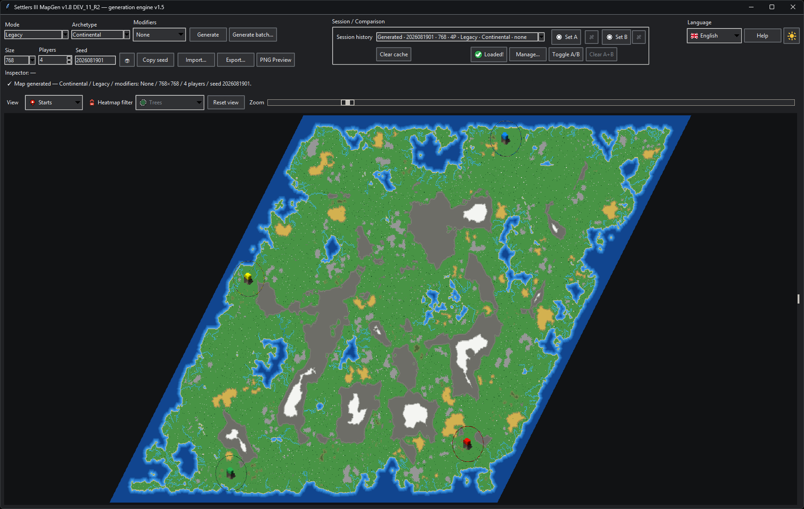
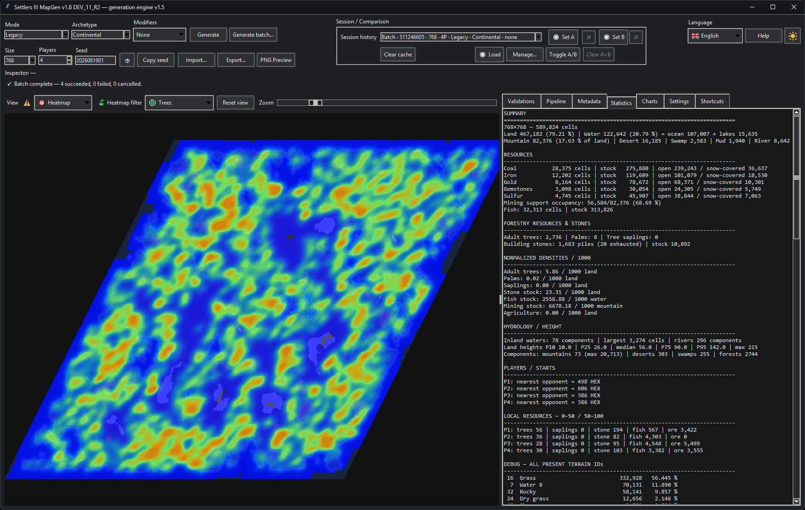
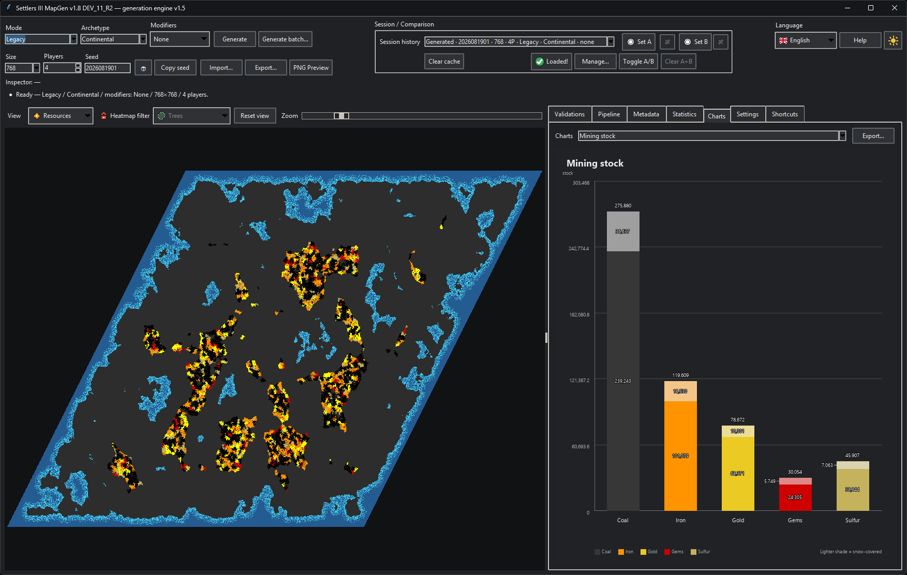
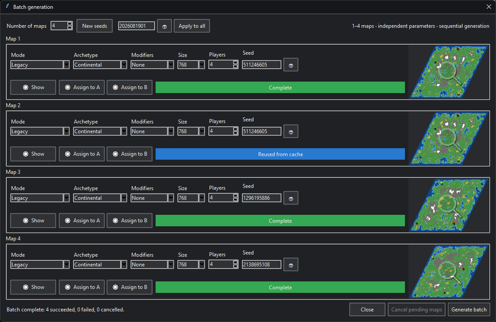

# Settlers III MapGen

**Français** · [English](README_EN.md)

> Générateur procédural expérimental pour **The Settlers III**, construit à partir de reverse-engineering des formats `.EDM`, `.MAP` et `.SAV`, d'analyses du générateur natif et de nombreuses validations dans l'éditeur et en jeu.

> **Note de développement / transparence :** ce projet est conçu, dirigé, testé et validé humainement, avec un usage important de **ChatGPT / OpenAI comme assistance d’implémentation**, notamment pour le backend, l’analyse technique et les outils de reverse-engineering. Cette assistance fait partie explicitement du processus de développement du projet.

## Présentation du projet

**Settlers III MapGen** a pour objectif de créer, analyser et à terme éditer des cartes Settlers III avec une génération procédurale reproductible et contrôlable.

Le projet poursuit trois objectifs complémentaires :

- **préserver le comportement historique du jeu** grâce au mode **Legacy**, qui sert de référence native et de base de reverse-engineering ;
- **proposer une génération améliorée** grâce au mode **Upgraded**, qui applique les règles de gameplay, de morphologie, de ressources et de sécurité affinées au cours du projet ;
- **ouvrir progressivement la génération à l'utilisateur** avec un futur mode **Custom**, où les paramètres pourront être ajustés manuellement tout en conservant les garde-fous critiques.

La forme générale de la carte est volontairement séparée du mode de génération. Les **archétypes** définissent la macro-géographie (continent, grandes îles, petites îles, etc.), tandis que le **mode de génération** contrôle le relief, les zones de terrain, l'hydrologie détaillée, les ressources, les objets, les positions de départ, la balance et les validations.

Le projet repose sur une règle importante : les **positions de départ des joueurs sont placées très tôt** dans le pipeline. Le reste de la génération doit ensuite s'adapter à ces zones réservées afin de réduire les positions invalides et de permettre un meilleur équilibrage des ressources.

Les aperçus visuels sont toujours des rendus déterministes issus des vraies données de carte ; aucune image de carte fictive n'est utilisée.

## Aperçus de l’application

### Génération et Viewer



*Carte réellement générée, projection parallélogramme et zones de départ des quatre joueurs.*

### Statistiques



*Rapport détaillé : terrains, ressources, hydrologie, relief, départs et inventaires d’IDs.*

### Graphiques



*Vue Ressources associée au graphique sémantique du stock minier, dont la part recouverte par la neige.*

### Génération par lot



*Quatre tâches séquentielles avec miniatures réelles ; la barre bleue montre une réutilisation volontaire du cache pour une configuration identique.*

## État actuel — v1.9 DEV_1 validée / moteur v1.5 stable

**v1.5 reste le checkpoint moteur validé et ne doit pas être modifié sans raison explicite.** La v1.7 ajoute au-dessus de ce moteur un socle complet Statistiques / Graphiques : analyses exactes, inventaires debug, densités normalisées, graphiques sémantiques, comparaison A/B et tooltips contextuels.

Référence moteur v1.5 :
`S3_V1_5_V7NOGAP_CORRECTED_UPGRADED_4P_768x768_seed_2026082202`

DEV_10 a finalisé le verrouillage manuel `M`, l’ordre visuel réorganisable et une capacité de cache strictement infranchissable. DEV_11_R1 a validé sous Windows la première tranche de maintenance : version visible centralisée, logique pure d’ordre/protection de l’historique isolée de Tk et ZIP source déterministe soumis à une validation complète puis à l’autodiagnostic depuis son propre dossier extrait.

DEV_11 a clôturé la passe publication/maintenabilité. La v1.9 DEV_1 corrige maintenant l’import de certains EDM valides qui conservent un remplissage terminal d’alignement ; les deux fichiers fautifs fournis chargent sous Windows. La suite de v1.9 est consacrée principalement à la restructuration interne de la GUI et des couches moteur/générateur, à comportement constant. Le Data Mapping revient vers la fin de v1.9.

DEV_9 a validé la faisabilité d’un paquet Windows x64 autonome `onedir`. Afin de garder le développement quotidien propre et fondé sur `run_gui.bat` / `run_gui.py`, ce paquet n’est plus reconstruit à chaque DEV : il reviendra pendant les Release Candidates avec deux distributions séparées, sources Python et Windows portable sans installation.

La GUI v1.6 comprend notamment :

- génération Legacy / Upgraded Continental 768×768 via le moteur v1.5 ;
- import EDM / MAP / SAV et export EDM+MAP 768 ;
- vues Global / Départs / Territoires / Élévation / Ressources / Chemins / Cultures / Carte thermique ;
- thème clair/sombre, projection Carrée/Parallélogramme, zoom/drag/recentrage ;
- FR/EN/DE/ES persistants avec bascule dynamique et repli anglais de sécurité ;
- inspecteur exact de cellule ;
- historique LRU unifié et configurable (4/8/12/16, 8 par défaut), centre de gestion, ordre visuel manuel, verrouillage `M` et comparaison A/B légère ;
- génération par lot de 1 à 4 cartes avec paramètres indépendants, file séquentielle, historique et affectation A/B ;
- centres d’export multi-format : EDM/MAP 768, copie SAV source inchangée lorsqu’elle existe, PNG Global/vue courante et Graphiques JSON/CSV/PNG ;
- vue Global épurée, Vue Départs dédiée avec 210 petits marqueurs sur le contour initial exact et opacité réglable ; miniatures Batch avec marqueurs masqués, petits ou normaux via un réglage persistant ;
- raccourcis configurables/persistants avec détection de conflits et aide F1 ;
- palette P1..P20 centralisée, recalée sur référence in-game (P9 quasi blanc, palette validée en R4) ;
- **lecture des starts d'origine d'un SAV v11** et contour initial fondé sur le masque natif exact de 3500 cellules.

### Qualité des traductions

Les interfaces **française et anglaise** sont les versions linguistiques de référence, relues et considérées comme correctes. Les traductions **allemande et espagnole** ont été produites automatiquement puis seulement partiellement revues ; elles peuvent donc contenir des formulations imparfaites ou un vocabulaire à affiner. Cette règle s’appliquera également aux futures langues tant qu’une relecture humaine compétente ne les aura pas validées. Les corrections proposées par des locuteurs sont les bienvenues.

Le contour SAV n'est plus une ellipse approximative : les coordonnées de départ sont lues dans le bloc joueur du SAV et le masque initial canonique a été reconstruit à partir de 145 régions natives identiques. DEV_4_R4 place un marqueur minimal sans chevauchement sur chacune des 210 cellules de cette frontière. Territoires affiche les claims runtime réels d'un SAV ; pour un EDM/MAP, elle reconstitue uniquement à l'écran les zones initiales exactes de 3500 cellules autour des starts, sans prétendre lire cette information dans le fichier.

> Les tailles autres que 768 restent visibles mais leur génération n'est pas encore calibrée. Le writer SAV n'est toujours pas implémenté : un SAV importé peut être lu et copié inchangé, jamais réinventé.

La **v1.7 STABLE** clôt le socle Statistiques / Graphiques. La **v1.8** a construit la passe Workflow / accessibilité / production. La **v1.9** consolide maintenant l’architecture interne avant de terminer par l’archéologie/data mapping. Le retour profond au générateur reste prévu pour la v1.10.

## Modes de génération

### Legacy

Mode orienté fidélité au générateur original de Settlers III et au corpus natif analysé. Il sert aussi de baseline de comparaison pour le reverse-engineering.

### Upgraded

Preset amélioré du projet. Il intègre les règles validées au fil des tests et du long-play : starts précoces, hydrologie corrigée, poissons et minerais rééquilibrés, SmallTree84, Building Stones avec footprint, décorations contrôlées, règles de transitions et validators spécifiques.

La matrice détaillée est disponible dans `references/SETTLERS3_UPGRADED_RULE_MATRIX_v1.md`.

### Custom

Mode futur permettant d'exposer les paramètres de génération à l'utilisateur. Il est actuellement réservé et non implémenté.

## Archétypes

- **Continental** — implémenté ;
- **Large Islands** — prévu ;
- **Small Islands** — prévu ;
- d'autres macro-formes pourront être ajoutées sans dupliquer le moteur de génération.

L'archétype décrit principalement la **forme globale terre/eau**. Les objets, ressources, formes locales des zones, balance et logique de starts appartiennent au mode de génération.

## Architecture des starts

Ordre conceptuel actuel :

```text
MapConfig
  ↓
Archetype : macro-layout
  ↓
Placement précoce des starts
  ↓
Réservation des zones techniques
  ↓
Relief / biomes / hydrologie détaillée
  ↓
Ressources et balance locale
  ↓
Objets / décorations
  ↓
Hydrologie finale / poissons
  ↓
Validators
  ↓
Export
```

Une passe tardive ne doit pas invalider un start réservé. Elle doit contourner la zone ou faire échouer explicitement la génération.

## Morphologie Upgraded

La première implémentation exécutable d'Upgraded 768 utilise encore le checkpoint terrain/height validé comme référence de morphologie locale. Cela évite de réinventer des formes déjà validées.

La prochaine grosse étape de génération est de **généraliser cette morphologie Upgraded** afin de produire de nouvelles formes fraîches et compatibles avec plusieurs tailles et archétypes sans dépendre d'un unique checkpoint 768.

Limite connue avant cette refonte : les seeds actuelles ne produisent que trois morphologies de base, ensuite présentées avec des rotations et parfois un miroir. L’audit seed/RNG et la diversification objective sont planifiés pour la v1.10.

## Installation Windows

Premier lancement :

```bat
install_and_run.bat
```

Si Python n'est pas encore installé :

```bat
install_python_and_run.bat
```

Lancements suivants :

```bat
run_gui.bat
```

Dépendances Python principales : NumPy, SciPy et Pillow.

## Validation

Les validators du programme sont des **garde-fous de non-régression**. Un PASS signifie que les règles encodées sont respectées ; il ne remplace pas une validation dans l'éditeur officiel ou en jeu.

La hiérarchie de validation du projet reste : parser/checksum → éditeur → View Map/smoke test → SAV runtime → long-play.

## Documentation technique

Les références principales sont dans `references/`. En particulier :

- `AGENTS.md` — consignes courtes auto-découvertes pour reprendre le travail ;
- `SETTLERS3_PREGEN_READ_FIRST.md` — point d'entrée obligatoire avant toute modification/génération ;
- `SETTLERS3_MAPGEN_REFERENCE_v15_LONGPLAY_RULES.md` — règles canoniques ;
- `SETTLERS3_UPGRADED_RULE_MATRIX_v1.md` — correspondance règles Upgraded / implémentation / validators ;
- `SETTLERS3_EDM_MAP_FORMAT_REFERENCE_v3.md` — format EDM/MAP ;
- `SETTLERS3_SAV_FORMAT_REFERENCE_v1.md` — lecture SAV ;
- `docs/ARCHITECTURE.md` — couches runtime, flux de données, invariants et zones protégées ;
- `docs/DEBUGGING.md` — diagnostic reproductible, commandes de validation et informations à conserver ;
- `docs/GITHUB_PUBLICATION.md` — métadonnées proposées et checklist de publication, sans modifier les réglages du dépôt ;
- `TODO_MAPGEN.md` — feuille de route courante.

## Versioning

L'historique Git rétroactif est conservé depuis la v1.0 avec des tags de version. Les nouvelles releases doivent mettre à jour le code, le changelog, les tests et la documentation avant création du tag.

## Récupérer la dernière release STABLE

Sous Windows, `update_latest_release.bat` interroge uniquement la dernière GitHub Release publiée et télécharge son archive officielle dans `updates/`. Il ne suit ni `main`, ni les builds DEV/RC et n'écrase jamais l'installation courante.
