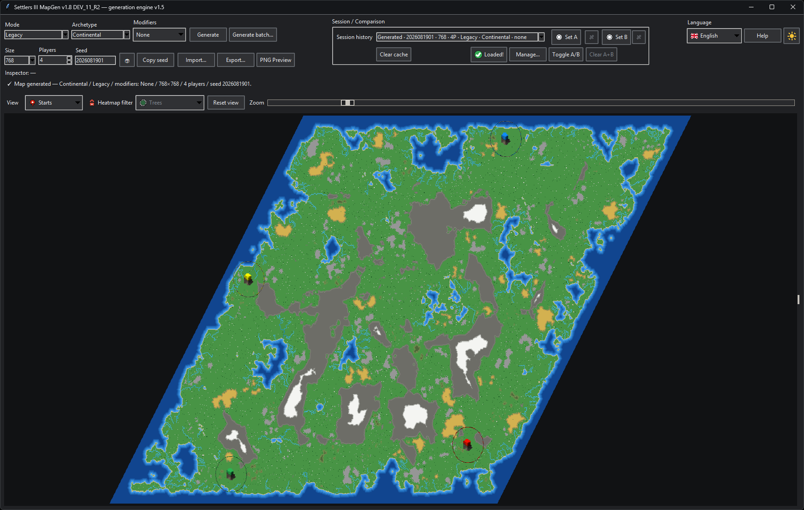
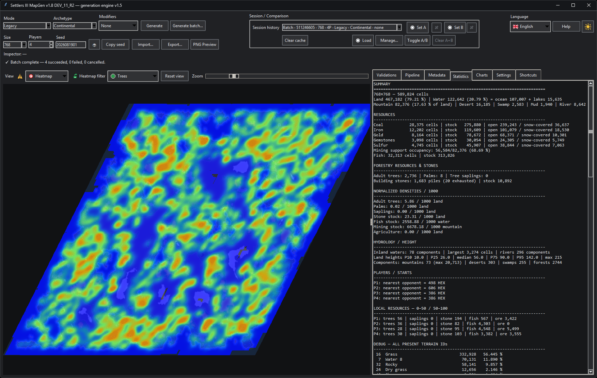
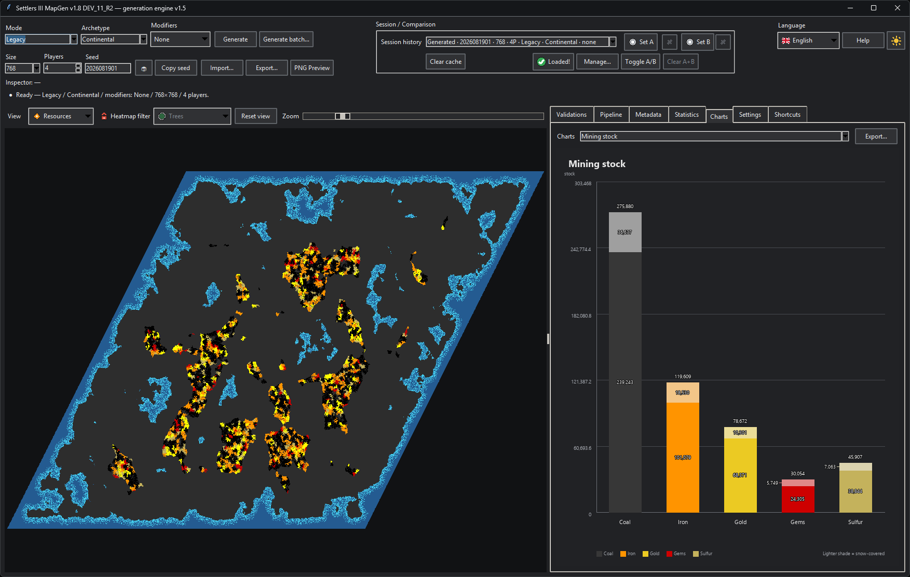
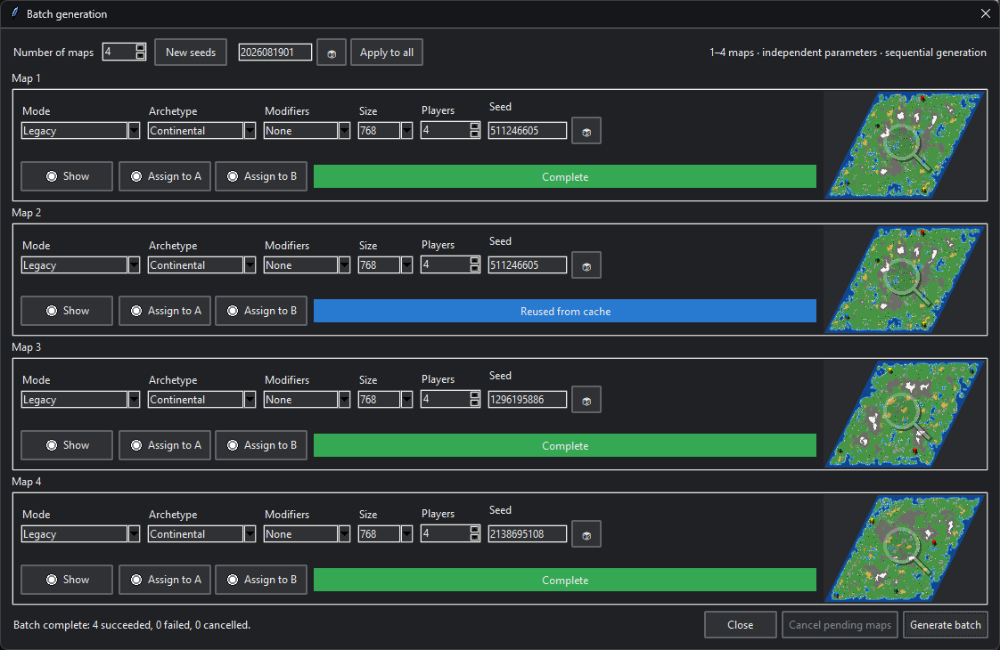

# Settlers III MapGen

**Français** · [English](README_EN.md)

> Générateur procédural expérimental pour **The Settlers III**, construit à partir de reverse-engineering des formats `.EDM`, `.MAP` et `.SAV`, d'analyses du générateur natif et de nombreuses validations dans l'éditeur et en jeu.

> **Note de développement / transparence :** ce projet est conçu, dirigé, testé et validé humainement, avec un usage important de **ChatGPT / OpenAI comme assistance d’implémentation**, notamment pour le backend, l’analyse technique et les outils de reverse-engineering. Cette assistance fait partie explicitement du processus de développement du projet.

## État actuel — v2.0 DEV_9

DEV9 clôt le focus **Grandes îles**, sur la base de R25 validée : une île et
un départ par joueur, relief indépendant, profils/composition communs et
rivières améliorées adaptatives. La source alternative s’appelle désormais
« Grandes îles — relief ondulé ». Voir [le bilan DEV9](docs/DEV_9_CHECKPOINT.md).

Qualification R25 : 818 tests, sept cartes et quatre exports PASS. Les
références complètes sont conservées dans le ZIP source et exclues du push.
Les anciens reports DEV9 passent à DEV10 ; leur répartition et Petites îles
(DEV10 ou DEV11) seront décidées au prochain bilan. Voir `TODO_MAPGEN.md`.

## Présentation du projet

**Settlers III MapGen** a pour objectif de créer, analyser et à terme éditer des cartes Settlers III avec une génération procédurale reproductible et contrôlable.

Le projet poursuit trois objectifs complémentaires :

- **préserver le comportement historique du jeu** grâce au mode **Legacy**, qui sert de référence native et de base de reverse-engineering ;
- **proposer une génération améliorée** grâce au mode **Upgraded**, qui applique les règles de gameplay, de morphologie, de ressources et de sécurité affinées au cours du projet ;
- **ouvrir progressivement la génération à l'utilisateur** avec le mode **Custom**, où les paramètres pourront être ajustés manuellement tout en conservant les garde-fous critiques.

La forme générale de la carte est volontairement séparée du mode de génération. Les **archétypes** définissent la macro-géographie (continent, grandes îles, petites îles, etc.), tandis que le **mode de génération** contrôle le relief, les zones de terrain, l'hydrologie détaillée, les ressources, les objets, les positions de départ, la balance et les validations.

Le projet repose sur une règle importante : les **positions de départ des joueurs sont placées très tôt** dans le pipeline. Le reste de la génération doit ensuite s'adapter à ces zones réservées afin de réduire les positions invalides et de permettre un meilleur équilibrage des ressources.

Les aperçus visuels sont toujours des rendus déterministes issus des vraies données de carte ; aucune image de carte fictive n'est utilisée.

## Aperçus de l’application

### Génération et Viewer



*Carte réellement générée, projection parallélogramme et zones de départ des quatre joueurs.*

### Statistiques



*Rapport détaillé : terrains, ressources, hydrologie, relief, départs et inventaires d’IDs.*

### Graphiques



*Vue Ressources associée au graphique sémantique du stock minier, dont la part recouverte par la neige.*

### Génération par lot



*Quatre tâches séquentielles avec miniatures réelles ; la barre bleue montre une réutilisation volontaire du cache pour une configuration identique.*

## Résultats de R63 avant les candidates R64/R65 — marge de domaine à zéro

R63 met à **0 % par défaut** la marge du domaine pour tous les archétypes,
comme sur le comportement natif Legacy. Le preset Custom R53 couvre maintenant
tout le carré de carte ; sa transition de bord reste à 8 %. La source Legacy
native ignore ce réglage, donc son relief ne change pas. Le 5 % historique reste
disponible et correspond à 18 cases sur le preset R53.

Sur la preview 256², seed `20260920`, le passage de 5 % à 0 % rapproche la
distance médiane du premier terrain au bord de 30 à 11 cases et réduit l’eau de
45,6 % à 23,9 %. La qualification montre que les départs passent (6/6), mais que les deux cas
768 dépassent légèrement la cible terre (86,2–86,8 %, maximum 85 %). Il faudra
juger ce compromis sous Windows puis recalibrer d’autres paramètres si besoin,
sans remettre de marge. L’effet du cadre carré sur les littoraux reste à
examiner. Les rivières Custom sont reportées, y compris le cas illégal d’une
rivière créée dans un lac. R63 reste une candidate locale.

### R55 — previews et providers pour Continental Custom

R55 corrige le cadrage des miniatures de fusion et de masque : l’enveloppe
absolue du Continental natif-calibré est maintenant réduite depuis le côté
réel de la carte vers les miniatures 128². Les fusions ne paraissent plus
dézoomées et les masques ne peuvent plus réintroduire d’influence dans le
cadre océanique. Les profils historiques en mode pourcentage restent
inchangés.

R54 avait ouvert `hybrid_fbm`, `turbulence`, `worley_f1`, `worley_f2` et
`worley_f2_minus_f1`. R55 ajoute `heterogeneous_fbm` et
`ridged_multifractal`, disponibles comme source principale, fusion ou source
de masque dans l’onglet **Archétype**. Ce sont des briques d’exploration ; la
composition du preset nommé R53 reste exactement la même et aucune forme n’est
dessinée à la main.

## Preset Continental Custom R53 — composition de noises

R53 reprend le preset Continental Custom réellement indépendant :
`Continental Custom R53 — fBm + warp + crêtes`. Il part d’un champ fBm
autonome, lui applique une fusion `domain warp` légère (`blend 15 %`), puis
une fusion `ridged` additive faible (`12 %`). Ce sont exactement les sources,
opérations et réglages visibles dans l’onglet **Archétype** ; aucun dessin,
gabarit de forme ou code de géométrie n’est caché dans le preset.

Le domaine extérieur est désormais calé sur l’enveloppe native mesurée : le
cadre et sa transition sont exprimés en cellules absolues, afin que l’océan ne
grandisse plus proportionnellement avec la taille de la carte. La masse
continentale retrouve ainsi une emprise proche du Continental natif.

Dans l’application : choisir le mode **Custom**, l’archétype **Continental**,
puis le preset dans le sélecteur **Profil de base** de l’onglet **Archétype**.
La source principale et les deux fusions restent ensuite modifiables dans le
même onglet. Le Continental natif demeure disponible comme profil de référence
et le code Legacy/Upgraded n’est pas modifié.

La commande `python tools/qualify_continental_custom.py` rejoue le preset sur
`384/512/768`, trois seeds et les miroirs `0/3`, puis exécute le chemin Custom
basé sur Legacy avec les cas de joueurs `2/4/max`. Les gates durs couvrent les
validations, le nombre exact de départs, leur unicité et leurs bornes.
`startable_mass` reste un diagnostic souple ; la validation visuelle Windows et
en jeu reste la prochaine étape.

## Historique récent — v2.0 DEV_8_R50 / qualification des masques

R50 ajoute une qualification déterministe du provider de masque manuel. La
commande `python tools/qualify_manual_masks.py` couvre par défaut les tailles
`384/512/768`, trois seeds (`20260920/21/22`) et les quatre miroirs natifs ;
elle vérifie la reproductibilité du signal, son effet sur la preview complète,
la stabilité de couverture, la variation conservée hors masque et la bordure
d’eau. `--mask chemin/image.png` permet de qualifier une image importée avec
le même resampling grayscale 64×64 que l’éditeur. Cette tranche reste
diagnostique et ne modifie aucune génération.

## Historique récent — v2.0 DEV_8_R49 / masques dessinables

R49 conserve la pile de masques indépendante et son contrat spatial générique,
et ajoute le provider « Dessin libre ». Chaque slot peut ouvrir une grille 64×64
pour peindre ou effacer une influence en niveaux de gris, importer une image et
exporter le masque en PNG. La grille est resamplée avec la taille, la position,
la rotation et la douceur communes ; l’opération module le champ complet après
les fusions et conserve la variation hors masque. La fenêtre d’édition suit
désormais correctement le thème sombre. Les nouveaux archétypes commencent
toujours avec zéro fusion active.

## Historique récent — v2.0 DEV_8_R42 / espace de travail redimensionnable

R42 conserve les quatre familles de réglages de R40 et rend aussi le groupe
« Fondamentaux » repliable, ouvert par défaut. Les mini-previews restent
volontairement fixes à 128², comme en R40, jusqu’à une future tranche dédiée.
L’en-tête reste ancré en haut lorsque le séparateur est déplacé, et la zone
Session / Comparaison conserve son reflow historique entre ses deux positions.
Un second séparateur vertical permet de régler la place de l’en-tête par
rapport à la zone carte/onglets ; sa position est mémorisée.

## Historique récent — v2.0 DEV_8_R41 / premier espace adaptatif

R41 avait rendu les mini-previews adaptatives ; ce comportement a été retiré
en R42 à la demande de l’utilisateur, sans modifier leur calcul ni leur
emplacement.

## Historique récent — v2.0 DEV_8_R40 / groupes de réglages repliables

R40 regroupait les réglages de chaque source de l’éditeur de noisemaps en
quatre familles : fondamentaux, transformations de sortie, remappage et
coordonnées. Les fondamentaux restaient visibles et les trois groupes avancés
étaient repliables séparément pour chaque source.

## Historique récent — v2.0 DEV_8_R39 / ergonomie ciblée de l’archétype

R39 conserve le reset global de l’archétype et ajoute seulement deux resets
locaux, désactivés tant que leur bloc n’est pas modifié : morphologie/source du
relief/seuils, puis éditeur de fusions. Les resets mettent à jour les contrôles
et les previews en place, sans effacer la vue ni ajouter un bouton à chaque
fusion. Les cartes de fusion séparent aussi leurs grilles d’en-tête, de
paramètres et d’actions afin que les champs longs ne provoquent plus de
décalages entre lignes.

## Historique récent — v2.0 DEV_8_R38 / remappage avancé des noises

R38 ajoute un remappage avancé indépendant à chaque source autonome : points
noir/blanc pour étendre ou resserrer la plage, seuils bas/haut durs ou adoucis,
plancher/plafond de sortie et courbe asymétrique. Ces réglages sont appliqués
avant le cadre fini, restent neutres par défaut et sont disponibles séparément
pour la source principale et chaque fusion. Ils servent à créer des reliefs
plus plats, plus étagés, plus concentrés ou volontairement dissymétriques sans
introduire encore de masque implicite.

R37 ajoute à chaque source autonome des transformations de coordonnées
indépendantes : décalage X/Y, échelle X/Y, répétition X/Y et symétrie X/Y.
Elles agissent avant les remappages de R36, restent bornées par le rectangle
intérieur fini et sont disponibles séparément pour la source principale et
chaque fusion. Les valeurs identitaires conservent les profils R36.

R36 conserve la preview exacte de R35 et ajoute des transformations communes à
chaque source autonome : inversion, valeur absolue, gamma et terrasses avec
mélange réglable. L’aide de l’éditeur de noisemaps est attachée à son titre ;
les valeurs identitaires préservent les profils existants.

R34 corrige le comportement de Solo : il isole uniquement une fusion déjà
active dans la preview, conserve la source principale et ne modifie jamais le
profil de génération. Une fusion décochée ou à force nulle ne peut plus être
réactivée par ce bouton.

Quand le lissage de la carte macro est désactivé, la preview passe directement
au calcul exact sans afficher ni calculer une passe indicative intermédiaire.
Le raffinement natif reste actif ; seul `_relax_relief` est retiré de cette
preview rapide. Le basculement invalide aussi immédiatement tout calcul
précédent afin que l’état choisi ne soit jamais recouvert par un résultat
obsolète. Chaque miniature de fusion fait maintenant 128² ; les boutons sont
placés après toutes les lignes de réglages, et la miniature « Source
principale » montre la source du relief avant les fusions, tandis que « Bruit /
hauteur » reste la vue composée.

R33 rend la pile de fusions directement manipulable depuis chaque carte :
réordonner les slots, dupliquer une fusion, la supprimer ou isoler son effet
dans un aperçu Solo. Solo ne modifie pas le profil utilisé par la génération
réelle ; il ne désactive les autres fusions que dans la copie de preview.

R32 place les trois vues principales en tête de l’onglet sur une rangée adaptée
au 1080p. Le nombre de fusions est réglable de zéro à six, sans perdre les
réglages des slots temporairement masqués. La source principale et chaque
fusion possèdent une miniature brute 128² calculée directement depuis leur
provider, sans pipeline macro. R31 conserve en complément la cohérence entre
les passes indicative et exacte et grise les réglages non consommés.

R30 poursuit R29, qui remplace la piste des presets de formes par un véritable éditeur de
noisemaps. La source principale peut utiliser Legacy natif, bruit blanc,
Value, Perlin, Simplex, fBm, Billow, Ridged, Worley ou Domain Warp. Jusqu’à six
sources autonomes supplémentaires peuvent être fusionnées par remplacement,
mélange, addition, soustraction, multiplication, minimum ou maximum. Chaque
source expose fréquence, octaves, lacunarité, gain, rotation, étirement,
décalage, contraste, warp et décalage de seed. Le domaine reste un rectangle
intérieur fini avec marge et transition de bord réglables.

Modifier l’onglet Archétype personnalise désormais l’archétype sans faire
passer le mode Générateur sur Custom. La noisemap et sa contribution sont
rendues directement sur une grille live 192², sans attendre la relaxation
native ; la macro exacte continue en arrière-plan. Chaque panneau remplace son
image en place, indépendamment, sans passage par une vue vide. Les métriques de
laboratoire détaillées ont été retirées de l’interface au profit des contrôles.
Le lissage de la carte macro peut maintenant être désactivé pour accélérer la
recherche de bruits ; ce réglage ne modifie pas la génération réelle.

La génération `v2.0 DEV_1` a été validée puis publiée sur GitHub. `DEV_2` a été
le checkpoint validé du reset natif, et `DEV_3` est maintenant le checkpoint
validé et publié : l'ancien générateur Legacy
procédural et ses bibliothèques dérivées ont été retirés, puis remplacés par
un portage natif v1. Le moteur Upgraded est maintenant reconstruit dans une
copie indépendante de ce pipeline. DEV_4 ajoute la liaison temporaire
Graphiques → Vue, sans liaison dans A/B, corrige le dialogue d’export hors 768,
déverrouille les trois miroirs aussi en Upgraded et rend ce mode disponible sur
toutes les tailles natives du contrat ; 768
conserve les quotas calibrés et les autres tailles utilisent des quotas
proportionnels pour rester générables. Aucune taille du contrat n’est bloquée
par un statut « non testé » : les avertissements restent informatifs. Le
réglage **Marqueurs de départ** propose désormais Petits, Normaux et
Grands, en plus de Masqués, dans toutes les vues, Batch et Historique ; une
option indépendante permet aussi d’afficher les cercles de départ partout.
DEV_5 ajoute le contenu Upgraded autour des départs : objets statiques calqués
sur Legacy, mini-forêts, bonus arbres/pierres et mini-marais, tout en
conservant les récifs spécifiques Upgraded. Le socle applicatif DEV_6_R61
reprend R57, conserve les formes et la profondeur des lacs, renforce la rive
à deux anneaux et reconstruit les rivières bonus avec le système natif local
(filtre 9×9, relief, éventail HEX6, marqueurs et retour arrière), sans
rechercher une destination vers l’eau existante. Une jonction accidentelle
reste possible si la géométrie la provoque, mais aucun trajet lac→mer n’est
recherché ; les rivières normales bonus utilisent River96 sans alternance des
quatre IDs. R58 borne le rayon maximal à `16 HEX6` et la cible maximale à `6`
rivières par lac, sans modifier le traceur validé. À `0`, le seuil d’eau native
depuis la bordure désactive le filtre ; les valeurs positives conservent ce
rayon d’exclusion. Les métadonnées enregistrent les tentatives, acceptations et
causes de refus par joueur et au total. La protection eau de la tour reste à 20 HEX sur toute l’emprise,
même hors forçage. Elle place
« Répartition » entre « Forme » et « Rayon commun » et conserve les valeurs
dérivées lors d’un changement de répartition ; R60 compacte maintenant le
panneau lac/rivière sur quatre colonnes, raccourcit le libellé de l’évitement
d’eau native et rapproche explicitement les listes de formes de leur libellé.
R61 remplace ce libellé par « Rayon de contrôle eau native », puis aligne tous
les contrôles du panneau lac/rivière sur une seule colonne verticale. La logique
de génération reste celle de R59 ;
elle conserve. La finition ergonomique de l’onglet Générateur est publiée dans
DEV_7. `DEV_8_R1` a été validée et ouvre l’onglet Archétype avec un profil macro
déclaratif Continental : une copie Custom inchangée reprend les mêmes seuils
de relief et les seuils modifiés sont appliqués à sa génération. Les fenêtres
de prévisualisation live noise et carte macro à cinq classes, avec projection
carrée/parallélogramme, taille réglable, réutilisation du bruit, progression et
taille adaptative, avec affichage final atomique, noise signée `-30 … 225`,
génération native complète sans approximation de résolution et adaptation aux
redimensionnements, font partie du socle `DEV_8_R11`. Le calcul des
previews est suspendu quand l’onglet Archétype n’est pas actif, puis reprend
avec la dernière demande utile au retour ; la dernière image complète reste
visible et la carte affiche la répartition des cinq classes macro avec un
avertissement si une classe est absente. Le contrat Continental affiche aussi
son moteur de relief, sa famille de bruit, sa plage signée, ses plages dérivées,
son modèle de masse terrestre et l’absence de micro-îles ; ces champs restent
verrouillés tant qu’aucun moteur réel ne les consomme. Les seuils de relief sont
vérifiés en parité avec les valeurs natives implicites sur plusieurs tailles et
miroirs. Les hexagones et la génération live détaillée du Générateur restent
reportés à la v2.1. R9 fiabilise en plus les callbacks de reflow après
reconstruction de l’onglet Générateur et la détection de molette sur les menus
déroulants temporaires Tk. R10 ajoute un diagnostic des masses terrestres
connectées dans l’aperçu et de la masse d’herbe réellement porteuse des
départs, sans changer les cartes. R11 ajoute les premiers paramètres de
morphologie réellement consommés : échelle spatiale des formes et contraste
du relief. À `100 %`, la sortie native reste inchangée ; les mêmes champs sont
utilisés par les previews et les moteurs Legacy/Upgraded. R17 réorganise les
deux couches de bruit introduites en R16 comme des composants sémantiques du
relief : le rôle actuellement disponible est `land_relief`, et chaque couche
choisit une fusion `add` ou `subtract`. Elles sont appliquées avant la
normalisation, la sculpture et la relaxation natives, uniquement sur les
cellules terrestres ; les cellules natives d’eau, y compris la couronne
extérieure, restent protégées. Le bruit multi-échelles reste déterministe et
partagé par les previews et les deux moteurs. R17 ne crée pas encore de lacs ni
de nouveau masque eau/terre. R46 ajoute depuis une pile de masques
paramétriques indépendante, avec modulation douce hors de la silhouette ; les
masques dessinables/importables et les rôles spécialisés restent les prochaines
extensions.
R12 sépare le chemin d’affichage de la noise map : le champ natif signé est
affiché dès la fin du relief brut, avant la sculpture et la relaxation finale,
pendant que la carte macro exacte continue en arrière-plan. Le champ brut est
mis en cache indépendamment de la morphologie, et les copies miroir ainsi que
la bordure d’eau sont réappliquées dans le même ordre que la preview native.
L’échelle est plafonnée à `100 %` pour conserver de l’eau autour de la carte.
La passe native `_relax_relief` reste inchangée dans les générations réelles ;
elle corrige les écarts locaux de hauteur jusqu’à stabilisation avant la
classification du terrain, et n’est contournée que par l’affichage rapide de
la noise map.
R13 ajoute une macro indicative calculée immédiatement depuis ce même champ
rapide : elle est clairement signalée comme provisoire, puis remplacée par la
macro exacte lorsque la sculpture et `_relax_relief` ont terminé. Les
statistiques exactes sont masquées pendant cette phase. La génération réelle
Legacy/Upgraded reste inchangée dans son résultat. R14 accélère la relaxation
exacte en conservant son parcours ordonné, ses corrections et sa sortie
`uint8`, ce qui réduit fortement l’attente sur les tailles `704+` sans
approximation de la preview finale. R15 unifie la progression visible :
`0–15 %` pour l’indicatif, `15–95 %` pour le calcul exact et `100 %` seulement
après le rendu final ; les redimensionnements ne peuvent plus la réinitialiser
ou l’achever prématurément. R17 conserve les couches de bruit optionnelles,
mais les rend lisibles dans l’éditeur d’archétype : rôle `land_relief`, fusion
`add`/`subtract`, et bruit multi-échelles déterministe. Désactivées par défaut,
elles ne changent pas la sortie native ; activées, elles modifient le relief
terrestre avant les étapes natives qui normalisent et relaxent le terrain. Les
cellules d’eau natives ne sont pas transformées et le cache du champ natif
inchangé n’est pas réutilisé pour une preview active.
R24 corrige la régression de R23 dans le troisième aperçu du laboratoire :
l’image 1 montre la source de relief sélectionnée, tandis que l’image 3 montre
uniquement la contribution brute des couches, en rouge/bleu. Le delta de la
source par rapport à Legacy et le champ composé restent séparés dans le
rapport de diagnostic.
R25 supprime le flash lors des re-previews en remplaçant les images dans leurs
panneaux existants et ajoute au laboratoire la part de terre brute ainsi que
les hauteurs P10/P50/P90 pour comparer les providers.
R26 conserve désormais le dernier triptyque complet pendant tout recalcul : la
phase indicative n’est plus peinte, et bruit/hauteur, macro et contribution
brute sont préparés puis remplacés ensemble seulement lorsque la preview exacte
est complète. Une erreur ou une valeur invalide conserve l’ancienne vue. Aucun
provider, réglage de bruit ou chemin Legacy/Upgraded n’est modifié ; la suite
porte d’abord sur la matrice de cibles et la qualification comparative des
providers existants.
R27 ajoute cette matrice pour Continental, Grandes îles et Petites îles, avec
les tailles natives `384–768`, les cas joueurs `2 / 4 / maximum` et les miroirs
`0 / 3`. Le nouvel outil `python tools/qualify_archetypes.py` compare les
providers existants sur la macro réellement produite : part terre/eau, bordure,
masse dominante, contact de côte et relief montagne/neige. La première passe
reste volontairement limitée à la macro-preview ; starts, constructibilité,
ressources, hydrologie détaillée et validation éditeur/jeu sont des gates
ultérieurs. Le run par défaut passe `12/12` ; le miroir 3 révèle un cas natif
existant à `384²` et `0,23 %` de montagne/neige (`11/12`), tandis que les
providers indépendants passent `9/9`. Ce diagnostic reste ouvert pour la suite.

R22 remplace l’essai R21 d’enveloppe post-génération : chaque provider est
généré directement dans un rectangle intérieur fini, avec une condition de
bord faible portée par le bruit lui-même ; l’extérieur du cadre est de l’eau.
Il n’y a donc pas de correction empilée après coup, les formes ne sont pas
coupées au bord du domaine et les previews calculent moins de cellules.

R20 corrigeait la limite de R19 : changer de bruit remplace maintenant toute la
matrice brute d’élévation, y compris ses zones d’eau, au lieu de conserver la
côte et le masque terrestre Legacy. Trois providers indépendants sont
disponibles : `fractal_fbm`, `warped_fbm` et `ridged_fbm`. Le moteur natif
consomme ensuite ce champ et applique lui-même normalisation, formes macro,
relaxation et classification. `native_legacy` reste le choix par défaut et
sa sortie est protégée par parité binaire. Les couches optionnelles ciblent le
domaine `source_land` de la source choisie ; elles ne réintroduisent donc pas
la côte Legacy. Le laboratoire sépare le champ de référence, la source active,
son delta et les contributions de couches. R20 ne prétend pas encore fournir
des rôles spécialisés pour les lacs ou l’eau.

R18 rendait le contrat de chaque composant inspectable : source, rôle, masque,
étape, fusion et ordre. La preview complète expose le champ natif avant
composition, le champ composé et une carte de contribution où le rouge
rehausse le relief et le bleu l’abaisse ; les statistiques listent les cellules
touchées et les bornes du delta. Les anciennes clés de profil R17 sont migrées
sans changement de sens. R18 ne remplace pas encore la source Legacy et ne
crée pas encore de lacs.
Les sections
sémantiques utilisables du générateur restent : Minerais, Poissons,
Arbres, Pierres de construction, Décorations et réglages détaillés des bonus de départ,
traductions dynamiques, profils dérivés des presets,
empreinte de configuration intégrée au cache, onglets Générateur/Archétype et
registre extensible des bonus de départ. Les minerais proposent les trois
algorithmes Legacy/Upgraded/Pixels aléatoires, avec occupation, répartition, tailles et ressource
moyenne ; les poissons proposent remplissage global ou dans une bande côtière
d'épaisseur réglable, avec repli global si cette bande dépasse les côtes. Les
détails techniques des profils ne sont pas exposés dans l'interface. Les réglages sélectionnés
sont appliqués au contenu Upgraded et au contenu ressources du pont Legacy,
sans modifier un profil via l’édition Custom. Le profil Upgraded de base porte
désormais la répartition 52,5 / 22,5 / 15 / 5 / 5 demandée ; son équivalent
Custom la reprend automatiquement. La méthode **Pixels aléatoires** pose
uniformément les cases compatibles sans former de gisements, y compris dans la
vue de ressources entrelacée réellement exportée. Le chemin
Upgraded et son Custom équivalent partagent désormais exactement les routines
de minerais et de poissons lorsque les paramètres sont identiques. Les éditions
Custom successives conservent les contrôles et leur focus, et la liaison
Graphiques → Vue est active par défaut.

La section Décorations expose un taux d’apparition indépendant de `0–500 %`
pour chaque famille statique déjà reconnue par le générateur ; `100 %` reprend
le comportement du profil sélectionné, sans exposer les identifiants ni les
règles de terrain et de collision. Le moteur **Legacy** implémente Continental v1 avec le relief, les terrains,
l'hydrologie, les objets, les ressources, les départs et les métadonnées de
partie observés dans S3.EXE. Le moteur **Upgraded** possède sa propre copie du
pipeline, calibrée sur Continental 768×768 mais générable sur toutes les tailles
du contrat. Il ajoute uniquement ses différences
explicites : minerais v7, poissons, arbres/décorations et pierres de
construction, sans boue. L'archétype Continental fournit le contexte macro-géographique ;
il ne sculpte pas une seconde forme par-dessus le noyau natif.
**DEV_5** conserve le pont provisoire de positionnement des starts. **R36**
corrige le bonus forêt dans les deux variantes Custom, **R37** consolide les
forêts et les pierres de départ, et **R40** supprime les réservations de cases vides
et unifie la route Custom : Legacy et Upgraded sont des presets spécifiques de
cette route et commencent avec les bonus désactivés, chaque panneau possède son
interrupteur, et la forêt demande par défaut `30` adultes et `20` pousses par
joueur. Les adultes sont posés avant les pousses, tous avec au moins `3 HEX6`
entre eux ; le rayon minimal est dérivé de ces quantités et peut s’étendre
automatiquement si le terrain l’exige. Les anciens champs de rayon de forêt ne
sont plus pris en compte. R37 plafonne les adultes et pousses à `100`, ainsi
que les forêts globales à `100` arbres, et affiche les pousses avec la même
couleur sur la carte et les graphiques. Les pierres demandent par défaut `15`
ancres par joueur, maximum `50`, avec une moyenne de `10` unités ; leur rayon
est dérivé automatiquement. R46 conserve le mini-marais de R42, génère une
forme `Native` indépendante pour chaque start avec le même plan
brosse/extension/érosion que les marais globaux, et ajoute un découpage strict
uniquement lorsque des bonus sont actifs : le chemin sans bonus
reste byte-identique à R42. Les bonus de terrain sont placés après les terrains
liés à l’archétype et avant les familles globales, puis les objets bonus sont
écrits avant tous les objets globaux ; aucune écriture bonus n’est supprimée
ensuite. R46 conserve le halo des écritures réelles de R45 pour toutes les familles
d’objets actives, y compris la passe native globale Legacy ; l’empreinte complète
des rochers reste protégée. Les adultes des forêts sont posés avant les pousses.
R54 conserve le mini-marais R42 avec une borne de rayon `1–16` ; R42 avait
remplacé les cases libres du bonus mini-marais par une liste de formes
extensible (`Native`, `Hexagone`) ; l’hexagone scale réellement avec le rayon et `Native`
réutilise le plan natif global des marais. Le nombre de cases est dérivé. Le switch d’objets compatibles avec l’herbe
autorise les terrains `18`, `19` et `24`, mais pas le terrain rocheux `34`, sans
effacer des objets déjà posés ; les bonus peuvent donc aussi utiliser ces
cases lorsqu’elles sont compatibles. Les sélections publiques Legacy et
Upgraded sont des presets de la même route Custom, avec les bonus désactivés
par défaut. R39 supprime aussi les pierres natives résiduelles lorsque le
taux global est à `0 %` et que le bonus local est désactivé ; le stock des
rochers bonus suit la même loi que le stock global. Les cinq bonus restent
hors quotas globaux, et le forçage à
distance élargie est maintenant disponible pour tous via une case commune,
désactivée par défaut, avec repli local lorsque la case est décochée. R13
raccorde la section Arbres aux deux moteurs Custom : quota de
base relatif, pousses (quota global ou quota séparé et placement), forêts (part,
moyenne et variation) et quota maximal relatif des palmiers. Le défaut Upgraded
est celui du profil actif, notamment `30 %` du quota adulte en forêts ; le défaut
Legacy n’active ni forêts ni pousses. Le socle DEV6 et la finition DEV7 sont
publiés ; DEV8 poursuit maintenant l’éditeur d’archétypes Custom.

La comparaison des minerais a été faite avant la suppression : l'ancien
générateur avait un mix global proche des SAV natifs, mais des composants et
des tailles de gisements nettement trop fragmentés. Ces quotas et heuristiques
ne sont donc pas conservés comme règles. Le détail reproductible est dans
`references/history/minerals/SETTLERS3_LEGACY_MINERAL_COMPARISON_DEV2.md`.

Le portage natif de référence est présent dans DEV_2 pour les tailles `256, 320, 384, 448,
512, 576, 640, 704, 768, 832, 896, 960 et 1024`. Les modes miroir proposent
`Axe long`, `Axe court` ou `Les deux`. Les tailles sous 384 et au-dessus de 768
restent exportables et signalées dans le feedback lorsqu'elles sortent du
cadre de jeu habituel. Les audits de l'algorithme restent la source de vérité ;
une validation dans l'éditeur/jeu reste nécessaire pour les exportations
étendues.

DEV_3 poursuit cette base avec la forme validée des blobs miniers compensée pour
la projection parallélogramme, le nom court validé du terrain `34` (**Patch
d’herbe rocheuse**) et son affichage distinct dans la carte et les graphiques.

La GUI et l'outillage validés restent disponibles : import EDM / MAP / SAV en
lecture, export EDM/MAP de toutes les tailles natives via scaffold de test,
vues d'analyse et d'inspection,
statistiques, graphiques, historique, comparaison A/B, génération par lot,
thèmes et langues FR/EN/DE/ES. Les aperçus restent des rendus déterministes de
données réelles ou de sorties identifiées du moteur conservé.

### Qualité des traductions

Les interfaces **française et anglaise** sont les versions linguistiques de référence, relues et considérées comme correctes. Les traductions **allemande et espagnole** ont été produites automatiquement puis seulement partiellement revues ; elles peuvent donc contenir des formulations imparfaites ou un vocabulaire à affiner. Cette règle s’appliquera également aux futures langues tant qu’une relecture humaine compétente ne les aura pas validées. Les corrections proposées par des locuteurs sont les bienvenues.

Les coordonnées de départ sont lues dans le bloc joueur du SAV. L'ancienne
forme canonique de 145 régions et 3 500 cellules est conservée uniquement comme
trace d'analyse historique ; elle ne sert jamais à remplir un masque. La vue
Masque initial affiche exclusivement les coordonnées directes du byte 8 d'un
SAV immédiat reconnu, tandis que Territoires affiche les claims runtime
réellement lus dans le SAV.

> Le writer SAV n'est toujours pas implémenté : un SAV importé peut être lu et copié inchangé, jamais réinventé. Les exports EDM/MAP utilisent pour l'instant le scaffold 768 comme enveloppe de test, y compris pour les tailles étendues ; leur compatibilité avec l'éditeur/jeu doit encore être vérifiée. Le moteur Upgraded actif est indépendant ; 768 reste une référence de calibration, pas une version ou un profil séparé, et toutes les tailles du contrat restent générables pour test. Il n'existe plus de moteur Upgraded v1.5 actif. Limite connue : certains SAV peuvent afficher des récifs sur terre à cause d'un décodage d'ID probablement incorrect ; correction reportée.

Les étapes v1.x sont historiques et leurs documents sont archivés. La ligne
active est désormais la v2.0 : finir le socle Custom, puis implémenter les
archétypes Custom et les modificateurs selon le TODO courant.

## Modes de génération

### Legacy

Moteur natif v1 pour l'archétype Continental, disponible sur les tailles du
contrat natif et avec les quatre combinaisons de miroir. Il suit l'ordre
relief/terrain, objets et ressources globales, re-seed, puis préparation des
départs ; les objets/ressources propres aux joueurs, les colons et l'écriture
SAV restent reportés à la future gestion des `.sav`. Les données runtime type 9
qui ne tiennent pas dans l'Area sont reportées explicitement dans le rapport.

### Upgraded

Preset amélioré du projet, disponible sur les tailles natives du contrat. Il intègre les règles validées au fil des tests et du long-play : hydrologie corrigée, poissons et minerais rééquilibrés, SmallTree84, Building Stones avec footprint, décorations contrôlées, règles de transitions et validators spécifiques. Le placement des joueurs est actuellement un pont provisoire ; son comportement natif sera traité dans une passe dédiée.

La matrice détaillée est disponible dans
`references/SETTLERS3_UPGRADED_RULE_MATRIX_CURRENT.md`. L'index
`references/REFERENCE_INDEX.md` indique les documents actifs et les archives.

### Custom

Mode laboratoire permettant d'exposer les paramètres de génération à
l'utilisateur. Une modification d'un preset crée une configuration Custom
séparée, identifiée par une empreinte et réutilisable dans le cache et Batch.
Les presets intégrés restent immuables. Les cinq bonus de départ actifs (forêt,
pierres, mini-marais, zone rocheuse minérale et mini-lac avec poissons/rivière)
sont décrits dans un registre extensible et restent hors quotas globaux.

## Archétypes

- **Continental** — implémenté ;
- **Large Islands** — prévu ;
- **Small Islands** — prévu ;
- d'autres macro-formes pourront être ajoutées sans dupliquer le moteur de génération.

L'archétype décrit principalement la **forme globale terre/eau**. Les objets, ressources, formes locales des zones, balance et logique de starts appartiennent au mode de génération.

## Architecture des starts

Les deux modes n'ont pas le même ordre. Le Legacy natif porte d'abord le
terrain et le contenu global ; l'Upgraded utilise pour l'instant un pont de
positionnement isolé, qui sera recalibré séparément :

```text
Legacy : MapConfig
  ↓
Continental : contexte macro
  ↓
Relief / terrain / hydrologie native
  ↓
Objets et ressources globales
  ↓
Re-seed puis starts de transition MAP/EDM
  ↓
Finalisation / validators
```

```text
Upgraded : MapConfig
  ↓
Continental : macro-layout
  ↓
Copie indépendante du relief / biomes / hydrologie
  ↓
Pont de positionnement provisoire des starts
  ↓
Ressources / objets globaux / validators
  ↓
Export
```

Une passe tardive ne doit pas invalider un start réservé. Elle doit contourner la zone ou faire échouer explicitement la génération.

## Morphologie Upgraded

L'implémentation actuelle d'Upgraded possède une copie indépendante de la
séquence terrain native validée, puis applique ses passes de contenu
spécifiques. Le 768×768 est une calibration protégée, pas une version séparée
du moteur ; le positionnement exact des joueurs reste une passe future.

La diversification des seeds et l'extension aux autres archétypes restent des
sujets futurs de la roadmap v2.0.

## Installation Windows

Premier lancement :

```bat
install_and_run.bat
```

Si Python n'est pas encore installé :

```bat
install_python_and_run.bat
```

Lancements suivants :

```bat
run_gui.bat
```

Dépendances Python principales : NumPy, SciPy et Pillow.

## Validation

Les validators du programme sont des **garde-fous de non-régression**. Un PASS signifie que les règles encodées sont respectées ; il ne remplace pas une validation dans l'éditeur officiel ou en jeu.

La hiérarchie de validation du projet reste : parser/checksum → éditeur → View Map/smoke test → SAV runtime → long-play.

La qualification reproductible des providers d’archétype se lance avec :

```text
python tools/qualify_archetypes.py --output qualification.json
```

## Documentation technique

Les références principales sont dans `references/`. En particulier :

- `AGENTS.md` — consignes courtes auto-découvertes pour reprendre le travail ;
- `SETTLERS3_PREGEN_READ_FIRST.md` — point d'entrée obligatoire avant toute modification/génération ;
- `REFERENCE_INDEX.md` — routage des références actives, historiques et de reprise ;
- `SETTLERS3_MAPGEN_REFERENCE_v15_LONGPLAY_RULES.md` — mesures long-play historiques, avec surcharge v2.0 ;
- `SETTLERS3_UPGRADED_RULE_MATRIX_CURRENT.md` — correspondance courante des règles Upgraded / Custom / validators ;
- `SETTLERS3_EDM_MAP_FORMAT_REFERENCE_v3.md` — format EDM/MAP ;
- `SETTLERS3_SAV_FORMAT_REFERENCE_v1.md` — lecture SAV ;
- `docs/ARCHITECTURE.md` — couches runtime, flux de données, invariants et zones protégées ;
- `docs/DEBUGGING.md` — diagnostic reproductible, commandes de validation et informations à conserver ;
- `docs/GITHUB_PUBLICATION.md` — métadonnées proposées et checklist de publication, sans modifier les réglages du dépôt ;
- `TODO_MAPGEN.md` — feuille de route courante.

## Versioning

L'historique Git rétroactif est conservé depuis la v1.0 avec des tags de version. Les nouvelles releases doivent mettre à jour le code, le changelog, les tests et la documentation avant création du tag.

## Récupérer la dernière release STABLE

Sous Windows, `update_latest_release.bat` interroge uniquement la dernière GitHub Release publiée et télécharge son archive officielle dans `updates/`. Il ne suit ni `main`, ni les builds DEV/RC et n'écrase jamais l'installation courante.

R58 reprend le moteur R48 et le forçage R47 (recherche par couronnes successives jusqu’à D+34)
et ajoute aux zones minérales charbon/fer/or une forme organique arrondie de
type gisement Upgraded,
des surfaces égales, au prorata des parts de gisements ou personnalisées par
minerai, ainsi qu’une moyenne de quantité globale ou dédiée. Le cœur reste
toujours entièrement minéralisé et une zone impossible est omise avec un
shortfall explicite. Le mode Hexagone et les rayons historiques restent
compatibles. Le panneau regroupe les familles dans une grille
`Minerai / Cœur / Moyenne` et désactive les rayons, la surface totale ou les
surfaces par minerai selon le mode sélectionné ; le prorata rappelle ses parts
globales. R50 ajoute les sprites 16×16 des trois familles et un seul rayon
commun en mode égal (`1–16 HEX6`). R54 reprend les finitions R51 : listes verrouillées, unités rapprochées,
unités `HEX6`/`cases`, grise les sprites quand leur famille est inactive, porte
le rayon maximal des marais à `16 HEX6`, borne chaque cœur à `1–820` cases et
adapte le total prorata à `820/1 640/2 460` selon les minerais actifs. Les plans objets sont
préparés avant écriture et les abords des tours restent protégés. Le mode OFF
conserve R46 pour les bonus existants. Forêts, pierres et marais validés ;
zones minérales et lac/rivière restent à valider séparément. À cette date, DEV7 était publié et DEV8_R1 restait une candidate locale.
R57 conserve les formes et profondeurs de R55, renforce les lacs à deux
anneaux de rive et construit chaque rivière bonus par un système natif local,
sans cible globale ni pont lac→mer recherché. Les jonctions accidentelles
restent possibles comme dans Legacy ; les systèmes normaux utilisent River96
sur toute leur longueur. R58 borne le rayon maximal à `16 HEX6` et la cible
maximale à `6` rivières par lac, sans modifier le traceur validé.
