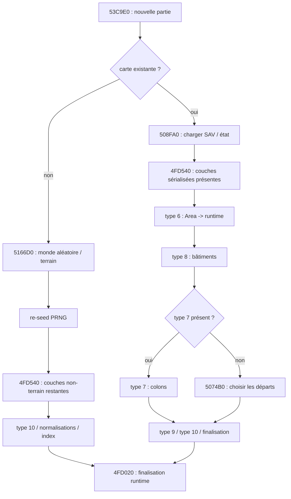

# Settlers III — audit statique non-terrain du générateur natif

Date : **2026-09-01**
Artefact analysé : `S3.EXE` — PE32 i386, 3 842 048 octets
SHA-256 : `25a6de6703ea3f9d88537aa309192ff0399b81f8a1221f40a222f36dc6be37a6`

> Cette passe est la suite de `S3_EXE_STATIC_GENERATOR_AUDIT_20260901.md`.
> Elle porte sur tout ce qui accompagne le champ terrain : cellules runtime,
> départs, bâtiments, colons, objets, ressources de sol, ressources de départ,
> métadonnées et matérialisation. Le binaire a été désassemblé en lecture seule.

## Résultat en une phrase

Le jeu ne possède pas une passe unique « génération de tout ». Le noyau aléatoire
`0x5166D0` enchaîne déjà le relief, le terrain principal, les objets statiques,
les minerais et les poissons de sol ; l'orchestrateur ajoute ensuite les départs,
les entités de partie, les métadonnées et la finalisation runtime. Le chemin de
chargement d'un état SAV sérialisé passe par `0x508FA0`, puis par la conversion
Area/type 6 -> cellules runtime ; ce n'est pas une seconde génération aléatoire.

La frontière est suffisamment nette pour définir l'architecture future
`Continental v1` / `Legacy v1`. Les producteurs initiaux des ressources de sol
et de nombreuses familles d'objets statiques sont maintenant reliés à
`0x5166D0`. La banque native d'offsets hexagonaux est également décodée
exactement. Le registre type 9 est lu par `0x4FD540` et alimenté pour les lots
de départ par `0x506CF0 -> 0x5046B0 -> 0x504420` ; le nom métier de ses champs et
son producteur dans d'éventuels fichiers externes restent à relier. Le chemin
exact d'export EDM/MAP n'est pas encore identifié. Cet audit ne prétend donc
pas que la partie non-terrain est déjà portable à 100 % ; il fixe les couches,
structures et règles effectivement démontrées.

## Statuts utilisés

- **CONFIRMED** : lecture ou écriture directement démontrée dans le code.
- **STRONG** : chaîne d'appels et effets suffisamment établis, mais nom métier
  ou rôle exact encore à confirmer.
- **PARTIAL** : structure ou branche connue, avec champs/sémantique incomplets.
- **TODO** : aucune règle de portage ne doit encore en être déduite.

## 1. Périmètre et séparation des couches

### 1.1 Ce qui est étudié ici

Cette passe suit les éléments non-terrain rencontrés sur le chemin de création
ou de chargement d'une partie :

1. le flot de l'orchestrateur de nouvelle partie ;
2. la copie `Area/type 6 (EDM/MAP ou SAV) -> cellules runtime` ;
3. les couches ressources, objets et registres d'entités ;
4. la sélection et la validation des départs ;
5. la création de la ville et du stock initial ;
6. les bâtiments, colons, ressources de départ et métadonnées ;
7. les normalisations et indexations post-chargement ;
8. ce qui est démontré, mais ne doit pas encore être porté.

### 1.2 Ce qui ne doit pas être mélangé

Les octets de formats et les structures runtime ont des rôles différents.
Une carte peut ainsi contenir simultanément :

| Couche | Représentation démontrée | Rôle prudent |
|---|---|---|
| Terrain principal | `EDM/MAP` type 6, byte 1 ; runtime `+0x6744A` | surface/transition |
| Ressource de sol | `EDM/MAP` type 6, byte 5 ; runtime `+0x67455` | minerai ou poisson porté par la cellule |
| Objet statique | type 6, byte 2 ; `SAV` byte 14 | décor ou objet de base |
| Objet/entité runtime | mot runtime `+0x67444` et registres | entité matérialisée, pile, colon, etc. |
| État objet runtime | `SAV` byte 7, encore partiel | état dynamique, pas le décor de base |
| Claim | type 6, byte 3 ; runtime `+0x6744C` | territoire/propriétaire |
| Accessibilité | type 6, byte 4 ; runtime `+0x6744E` | occupation, accès et protections |
| Joueur | type 2 ou slots runtime | nation, départ, relation de miroir |

Le portage devra donc garder des sorties séparées, même si elles sont
finalement sérialisées dans un même fichier.

## 2. Flot complet démontré autour d'une nouvelle partie

L'orchestrateur principal commence à `0x53C9E0`. Le chemin pertinent est le
suivant :



### 2.1 Ordre et preuves

| Ordre | Adresse / branche | Effet observé | Statut |
|---:|---|---|---|
| 1 | `0x53C9E0` | initialise les structures de partie et les slots joueurs | CONFIRMED |
| 2a | `0x508FA0` | chemin `GameDataSave::Load` d'un état SAV déjà sérialisé lorsque le test de configuration est vrai | CONFIRMED |
| 2b | `0x5166D0` via `0x53CE35` | produit directement dans la grille runtime le relief, le terrain principal, les objets statiques et les ressources de sol initiales | CONFIRMED |
| 3a | `0x4FD540` | sur le chemin chargé seulement, copie l'Area/type 6 dans les cellules runtime si le record type 6 existe | CONFIRMED |
| 3b | `0x53CE44` | retire la configuration de génération puis réinitialise le même PRNG avant les couches de partie | CONFIRMED |
| 4 | `0x4FD540` | lit les bâtiments/type 8 présents et appelle `0x4DD280` | CONFIRMED |
| 5a | `0x4FD540` | lit les colons/type 7 et appelle `0x50C9E0`, `0x50DC10` ou `0x50DD20` | CONFIRMED |
| 5b | `0x4FE28D` | si aucun type 7 n'est présent, appelle `0x5074B0` pour les départs d'une nouvelle carte | CONFIRMED |
| 6 | `0x4FD540` / `0x506CF0` | lit les records type 9 chargés ; le chemin aléatoire crée le stock initial dans le registre via `0x5046B0` | CONFIRMED |
| 7 | `0x4FE4D2` | lit le type 10 dans une structure runtime de métadonnées | CONFIRMED |
| 8 | `0x4FE5DC` et `0x4DFA60` | conversions et post-traitements dépendant du contexte | PARTIAL |
| 9 | `0x4FD020` | initialise index, registres et valeurs de runtime | CONFIRMED |

### 2.2 Réinitialisation du PRNG avant les couches de partie

Le chemin aléatoire ne continue pas avec un seul état PRNG jusqu'aux départs.
Lors de l'appel à `0x5166D0`, le premier argument (champ de configuration
`+0x14`) initialise `0x4FEB40` et sert aussi de côté actif ; le deuxième
argument (`+0x08`) devient le masque de mode `world + 0x2D274`. Le troisième
argument (`+0x10`) est transmis mais n'est pas consommé par le noyau central.

Après le retour de `0x5166D0`, l'orchestrateur `0x53C9E0` appelle `0x437050`
sur l'objet global `0x7A7A18`. Ce getter lit le mot à `+0x88`, puis la valeur
est passée à `0x4FEB40` à `0x53CE55`. C'est donc une **nouvelle initialisation
du même PRNG** avant la boucle des slots joueurs et les branches de
matérialisation non-terrain. Les tirages des départs ne sont pas la simple
continuation de la suite consommée par le relief, les objets et les minerais.

Cette séparation est démontrée pour `0x5074B0`, qui appelle ensuite `0x4FEB70`.
Les lots de départ suivent ensuite `0x506CF0` et `0x5046B0`, qui consomment ce
même état réinitialisé. Il n'existe pas d'appel direct démontré de `0x5166D0`
vers le producteur de registre `0x504420`.

### 2.3 Frontière exacte entre nouvelle carte et carte chargée

Le branchement de `0x53C9E0` doit être conservé dans le portage. Une carte
existante passe d'abord par `0x508FA0`, puis `0x4FD540` peut matérialiser le
record type 6, les bâtiments type 8, les colons type 7, les records type 9 et
les métadonnées type 10. Une nouvelle carte suit un autre chemin :

```text
configuration type 5
  -> 0x5166D0 : écrit directement terrain/objets/ressources dans le runtime
  -> 0x4A6310 : retire la configuration
  -> 0x437050 -> 0x4FEB40 : re-seed
  -> 0x4FD540 : traite les records non-terrain éventuellement présents
  -> 0x5074B0 : sélectionne les départs si aucun type 7 n'est chargé
  -> 0x506CF0 : ville, entités et stock du départ accepté
  -> 0x4FD020 : indexation/finalisation
```

Dans le chemin aléatoire, il n'y a donc pas de seconde copie Area/type 6 qui
serait nécessaire pour obtenir le terrain : cette copie est conditionnée par
la présence d'un record type 6 et concerne le chargement. Les structures
type 8/7/9 produites ensuite ne constituent pas une nouvelle passe de terrain.

### 2.4 Conséquence pour l'hypothèse de génération

Le fait que `0x5166D0` soit appelé avant `0x4FD540` ne signifie pas que cette
routine pose à elle seule toutes les entités de la partie. Le chemin direct de
`0x5166D0` ne contient aucun appel démontré à `0x50C9E0`, `0x50CB20`,
`0x50DD20`, `0x504420` ou `0x4DD280` : ces helpers matérialisent des entités,
des bâtiments ou des registres plus tard. En revanche, `0x5166D0` écrit bien
directement les ressources de sol et les objets statiques dans la grille
runtime, via `0x51AD40`, `0x51B010` et `0x51B1A0`.

Cela n'exclut pas une écriture indirecte dans un conteneur intermédiaire ; cela
exclut seulement l'idée d'une pose directe d'entités par ces allocateurs dans le
noyau terrain observé. Inversement, l'absence du type 6 dans le chemin
aléatoire ne signifie pas que les cellules sont absentes : `0x5166D0` les a
déjà écrites dans le runtime.

## 3. Matérialisation de l'Area/type 6

### 3.1 Lecture du côté et parcours

`0x4FD540` recherche la partie type 6, lit son côté aux octets `+8..+11`, le
stocke à `world + 0x2D2D0`, puis parcourt la grille. Chaque cellule Area fait
6 octets. Le pas d'une ligne runtime est `0x4800` pour une grille maximale de
768 cellules et le pas d'une cellule est `0x18`.

Le format d'entrée établi reste :

```text
[ hauteur, terrain, objet_statique, claim, accessibilité, ressource_sol ]
```

### 3.2 Copie champ par champ

Pour une cellule runtime dont le pointeur de travail est
`world + index*0x18 + 0x6744F`, le désassemblage réalise les correspondances
suivantes :

| Entrée type 6 | Destination runtime observée | Effet |
|---:|---:|---|
| byte 0 | `+0x67448` | hauteur |
| byte 1 | `+0x6744A` | terrain principal |
| byte 2 | `+0x6744B` et mot `+0x67452` | objet statique / valeur élargie |
| byte 3 | `+0x6744C` après table de mapping | claim runtime |
| byte 4 | `+0x6744E` | accès/occupation |
| byte 5 | `+0x67455` | ressource de sol |

La table de mapping joueur est fournie par l'appelant. Si le claim n'est pas
`0xFF` mais que sa correspondance vaut `0xFF`, le runtime conserve
`+0x6744C = 0xFF` et pose un drapeau de cellule à `+0x6744F`. Si le claim est
valide, le code force également le bit `0x40` dans l'accessibilité à
`+0x6744E`.

Avant les phases suivantes, le loader remet à zéro plusieurs champs runtime,
notamment le mot dynamique `+0x67444`, le mot associé `+0x67446`, des champs
auxiliaires autour de `+0x6744D`, `+0x67454`, `+0x67456` et `+0x67458`.
Ce nettoyage explique pourquoi une cellule Area complète n'est pas encore une
entité runtime complète.

### 3.3 Cas spécial des récifs

Si le terrain d'entrée est un niveau d'eau `0..7` et l'objet d'entrée est un
récif `0x6F..0x72` (111..114), le loader soustrait `0x62` à l'objet avant de
le conserver dans le champ runtime. Les valeurs runtime deviennent donc
`13..16` dans ce chemin.

Cette conversion est une normalisation de représentation pendant le chargement,
pas une preuve d'un tirage aléatoire différent.

## 4. Couches d'objets et de ressources

### 4.1 Ressource de sol par cellule

**CONFIRMED :** le byte 5 de l'Area est recopié dans `+0x67455`. Sur le chemin
aléatoire, le même champ runtime est alimenté directement par `0x5166D0`.
Les familles observées sont :

| Nibble haut | Famille |
|---:|---|
| `0x00` | poisson dans le contexte eau ; le haut nul ne signifie pas toujours absence |
| `0x10` | charbon |
| `0x20` | minerai de fer |
| `0x30` | or |
| `0x40` | gemmes |
| `0x50` | soufre |

Le low nibble est une quantité ou un niveau de présence selon le contexte.
Les observations natives SAV et les preuves d'édition sont regroupées dans
`SETTLERS3_NATIVE_RESOURCES_OBJECT_PROXIMITY_REFERENCE_v1.md`.

### 4.2 Ressources de sol initiales — `0x51AD40` et `0x518A08`

La chaîne d'appel est maintenant **CONFIRMED** : `0x5166D0` appelle cinq fois
`0x51AD40`, puis exécute une passe poissons à `0x518A08`. Les appels sont dans
cet ordre exact :

| Appel | Nibble haut écrit | Coefficient transmis |
|---:|---:|---:|
| `0x5189D4` | `0x50` — soufre | `30` |
| `0x5189DF` | `0x40` — gemmes | `20` |
| `0x5189EA` | `0x30` — or | `60` |
| `0x5189F5` | `0x20` — fer | `100` |
| `0x518A03` | `0x10` — charbon | `300` |

Pour un côté `side`, `0x51AD40` calcule :

```text
t = (side + 63) >> 6
nombre_de_lots = (t * t * coefficient) >> 3
```

Chaque lot tire un centre avec deux mots `PRNG16` : le produit 16×16 est
multiplié par `side` puis réduit par décalage de 16 bits (centre dans
`0..side-1`). Il tire ensuite un nombre d'essais dans
`32..95` et un seuil dans `32768..65535`. Pour chaque essai, il lit un couple
`(dx,dy)` dans la banque `world + 0x110A58C`, au pas de 16 octets, et rejette
les coordonnées hors de l'intervalle strict `1..side-2`. Il accepte seulement
une cellule dont `(terrain & 0xF0)` vaut `0x20` ou `0x80`, dont la ressource
vaut zéro, et dont le nouveau tirage `PRNG16` est strictement inférieur au
seuil. La valeur écrite est exactement `base + 1 .. base + 15`, avec un tirage
uniforme par reste modulo 15. Il n'y a ni wrap ni écrasement d'une ressource
déjà présente dans cette routine.

La passe poissons de `0x518A08` parcourt le carré de pointeurs correspondant à
`(side-1) × (side-1)` cellules, sans wrap. Une cellule est candidate si son
terrain vérifie `(terrain & 0xF0) == 0` et sa ressource vaut zéro. Un premier
`PRNG16` doit être strictement supérieur à `0x9C40` (`40000`), puis un second
écrit `PRNG16 & 0x0F`, donc une valeur `0..15`. L'orientation mémoire exacte
du double parcours reste à annoter, mais sa borne et son absence de wrap sont
démontrées.

Les écritures de ressource découvertes ailleurs sont séparées de cette phase :
`0x4E8A01` redistribue des ressources pendant la simulation, `0x54979F` et
`0x5497A9` appartiennent à des handlers de jeu, et `0x518B07` copie une grille
temporaire vers le runtime lorsque le flag de branche vaut `2`. Elles ne doivent
pas être prises pour le générateur initial. La transformation conditionnelle
de `0x4FE5DC` reste une normalisation post-chargement, non une règle universelle.

### 4.3 Ressources de départ et registres — type 9 / `0x504420`

Le type 9 est lu après les colons. Le loader consomme exactement des records de
**8 octets** et leur disposition utilisée par `0x4FD540` est maintenant établie :

| Offset du record | Lecture dans `0x4FD540` | Usage démontré |
|---:|---|---|
| `+0..1` | `uint16_le` | coordonnée X passée au registre |
| `+2..3` | `uint16_le` | coordonnée Y passée au registre |
| `+4` | octet | troisième argument de `0x504420`, sauf normalisation ci-dessous |
| `+5` | octet | quatrième argument de `0x504420` |
| `+6` | octet | cinquième argument et sélecteur de branche |
| `+7` | non lu dans cette boucle | sémantique encore ouverte, ne pas réutiliser |

Avant la pose, si `record[5] == 0` et `record[6] == 0`, le loader remplace
`record[4]` par `0xFF`. Si la cellule cible est libre (`+0x6744F == 0`),
`record[6] != 0` déclenche l'allocation par `0x504420`, avec les arguments
`(x, y, record[4], record[5], record[6])`. Lorsque `record[6] == 0`, le code
prend un chemin de liaison/mise à jour à partir du lien existant `+0x67446`.
Le type 9 ne doit donc pas être fusionné avec le byte ressource de l'Area.

`0x504420` alloue ensuite une entrée de stride `0x0E` dans le registre à partir
de `world + 0x123886A`. La correspondance de stockage observée est :

| Entrée registre | Valeur copiée |
|---:|---|
| `+0x00` | `record[4]` |
| `+0x05` | `record[5]` |
| `+0x08` | `record[6]` |
| `+0x0A` | X |
| `+0x0C` | Y |

L'index maximum du registre est maintenu autour de `world + 0x1238858`, puis
l'indice de l'entrée est relié à la cellule par le mot runtime `+0x67446`.
Les noms métier de `record[4..7]` restent **PARTIAL**, mais la structure binaire,
la condition `record[6] != 0` et le lien cellule-registre sont **CONFIRMED**.

#### Producteur aléatoire observé dans une nouvelle carte

La passe ciblée de `0x5046B0` ferme le doute sur le producteur des premiers
records type 9 du chemin aléatoire. Sa signature cdecl est :

```text
0x5046B0(world, value, type, x, y)
```

`0x506CF0` l'appelle avec le point de départ accepté. La routine parcourt la
banque d'offsets depuis `world+0x110A58C`, au plus jusqu'à l'index
`0x270F` inclus, et teste chaque cellule candidate. Elle exige notamment une
cellule existante, un lien runtime `+0x67446` non nul, l'absence du bit d'accès
`0x20`, puis vérifie la valeur/état du record lié. Pour un emplacement
compatible, elle peut créer le record avec :

```text
0x504420(candidate_x, candidate_y, value, type, 0xFE)
```

ou mettre à jour le record déjà lié via `0x4FFB00`. Le registre doit être dans
l'état `0xFE` et le compteur de sous-éléments rester inférieur à `8`. Le
producteur du stock initial est donc localisé dans la matérialisation de la
ville (`0x506CF0 -> 0x5046B0`), après le re-seed ; il n'est pas une sous-passe
directe de `0x5166D0`. Le producteur de records type 9 lus depuis un fichier
EDM/MAP ou une autre source sérialisée n'est pas nécessaire à cette conclusion
et reste séparé.

### 4.4 Entités qui portent ou consomment des ressources

`0x50C9E0` alloue une entité dans une table de slots de stride `0x40` :

- premier slot libre marqué `0xFF` ;
- limite observée `0x7CFF` ;
- propriétaire à `+0x12A5E60` ;
- type à `+0x12A5E61` ;
- coordonnées à `+0x12A5E64` et `+0x12A5E66` ;
- champs dérivés initialisés par `0x510470`, `0x503880` et `0x4FEB70` ;
- identifiant de l'entité écrit dans le mot runtime `+0x67444` de la cellule.

`0x50CB20` cherche une cellule adaptée autour d'un point de base, puis appelle
`0x50C9E0`. Les contrôles directement visibles sont :

```text
coordonnées dans la carte
mot runtime +0x67444 == 0
terrain >= 0x10
accessibilité & 0x0F == 0
claim == propriétaire demandé
```

Après la création, cette routine incrémente une table de compteurs par joueur
à `+0x11944A8` dans les cas autorisés par la table statique `0x658F64`.
Ce compteur est une comptabilité d'entités/stock, pas une preuve du générateur
des gisements.

## 5. Départs des joueurs

### 5.1 Slots et modes

`0x5074B0` parcourt **20 slots**, espacés de `0x148` octets. Les champs dont
l'usage est directement établi sont :

| Décalage dans le slot | Usage observé |
|---:|---|
| `+0x11943DC` | slot actif / catégorie de placement |
| `+0x11943E0` | paramètre de profil utilisé par la ville et les motifs |
| `+0x11943E8` | identifiant de joueur miroir à rechercher |
| `+0x11943EC` | X fixe, ou `-1` pour demander un tirage |
| `+0x11943F0` | Y fixe |
| `+0x11943F4` | départ déjà placé |
| `+0x11943F8` | autre valeur de configuration/identité, sémantique partielle |

Le mode est lu dans `world + 0x2D274` et dispatché par la table située à
`0x507EF4` :

| Mode | Entrée du bloc |
|---:|---:|
| 0 | `0x507517` |
| 1 | `0x507654` |
| 2 | `0x507854` |
| 3 | `0x507AA7` |

Les noms métier des quatre modes ne sont pas encore prouvés. Les modes 1 à 3
cherchent explicitement des joueurs miroirs avec `0x507F10`.

### 5.2 Tirages et essais

Un placement aléatoire peut aller jusqu'à `0xF4240` = **1 000 000 essais**.
Un placement à coordonnées fixes parcourt jusqu'à `0x2710` = **10 000
décalages** dans la table runtime d'offsets commençant à `+0x110A58C`.

Les coordonnées tirées sont des multiplications 16 bits suivies d'un décalage
de 16 bits, et non un appel à une distribution flottante :

```text
u = PRNG16()

mode 0 : coord = ((u * (taille - 0x1F)) >> 16) + 0x10
mode 1 : coord = ((u * (taille - 0x3F)) >> 16) + 0x20
mode 2 : coord = ((u * (taille - 0x3F)) >> 16) + 0x20
mode 3 : coord = ((u * (taille - 0x1F)) >> 16) + 0x10
```

Les deux coordonnées utilisent chacune un nouveau mot PRNG. Les modes 1 à 3
ajoutent ensuite des tests de séparation avant d'accepter le candidat.

### 5.3 Helper de séparation `0x4FF320`

La routine prend quatre entiers `(a,b,c,d)`. Son calcul exact est :

```text
si a < c:
    si b < d: retourner min(c-a, d-b)
    sinon:     retourner (c-a) + (b-d)
sinon:
    si b < d: retourner (a-c) + (d-b)
    sinon:     retourner min(a-c, b-d)
```

Les appels forment des paires de coordonnées et rejettent généralement une
configuration lorsque le résultat est `<= 0x3C` (60). La routine elle-même ne
lit ni la taille de la carte ni une table de wrap ; il ne faut donc pas la
nommer « distance torique » sans preuve supplémentaire. Elle ressemble à une
distance adaptée aux coordonnées obliques/hexagonales, mais son nom géométrique
reste **PARTIAL**.

### 5.4 Recherche des miroirs `0x507F10`

```text
for slot = 0 .. 19:
    s = world + slot * 0x148
    if s.active != 0
       and s.placed == 0
       and s.mirror_id == requested_id:
        return slot
return -1
```

La fonction parcourt bien 20 entrées, ignore les slots inactifs ou déjà placés,
et renvoie l'indice du premier miroir correspondant.

### 5.5 Deux niveaux de validation

#### Empreinte statique : `0x508420 -> 0x4D99E0`

`0x508420` est un wrapper qui passe les coordonnées au gros helper
`0x4D99E0` avec les constantes `2` et `0x0F`. Ce helper :

- impose une marge d'au moins 15 cellules environ autour du candidat ;
- forme la clé `pattern_kind + 57 * profile`, puis lit le bloc de
  `0x960` octets à `0x6AA174 + 0x960 * clé` ;
- interprète des tokens 32 bits par paires de décalages et des contrôles
  `0x80000000..0x80000005` ; `0x80000000` délimite le début du flux utile,
  `0x80000001` et `0x80000002` changent de branche, et `0x80000003` termine
  le flux ; `0x80000004`/`0x80000005` sont observés dans l'en-tête brut des
  blocs et ne doivent pas être lus comme des couples de coordonnées ;
- vérifie claim, terrain, flags d'accès et mots d'objet des cellules voisines ;
- rejette des cellules occupées ou incompatibles ;
- traite plusieurs variantes selon les paramètres du slot.

Le wrapper appelle `0x4D99E0(x,y,0x0F,slot,2)`. Dans le helper, le dernier
argument supérieur ou égal à `2` est réduit de `2` et force le contexte interne
à `0xFF`. Pour le wrapper normal, le profil `0` sélectionne le bloc de clé 15
et la branche interne 0. Les contrôles pilotent des branches d'interprétation
du motif ; leur correspondance avec chaque forme de ville reste brute pour les
autres profils. La table `0x6AA174` est donc une donnée d'empreinte de
placement, pas un bruit de terrain, et la banque d'offsets `+0x110A58C` est une
ressource distincte pour l'ordre des candidats.

### Bornes brutes de la table d'empreintes

La table commence à l'adresse virtuelle 0x6AA174. Dans le fichier PE, la
section data commence à la VMA 0x692000 et à l'offset 0x292000 ; l'adresse de
la table correspond donc à l'offset fichier 0x2AA174.

Les blocs de clé 0 à 227 occupent exactement 228 × 0x960 = 0x85800 octets.
Le bloc de clé 228, à l'adresse virtuelle 0x72FAF4, commence une autre donnée.
La clé 0 est nulle ; les clés 1 à 227 contiennent les tokens statiques. Pour
le profil normal et pattern_kind=0x0F, les quatre blocs directement utilisés
sont les clés 15, 72, 129 et 186. Cette borne est certaine même si la
signification métier des variantes reste partielle.

#### Empreinte normale Continental : flux désormais extrait

Le bloc de clé 15 (profil normal `0`, `pattern_kind=0x0F`) contient un en-tête
avant le premier `0x80000000`. Le flux utile commence au mot 20 du bloc et se
termine au mot 89 par `0x80000003`. Il contient exactement 33 couples de
coordonnées : 16 dans la première section, puis 17 dans la seconde. Les
contrôles intermédiaires sont `0x80000001` au mot 51 et `0x80000002` au mot 54.

La transcription native
`references/S3_EXE_NON_TERRAIN_RECONSTRUCTION_20260901.cpp` et le module
`s3mapgen/generation/generators/legacy/native.py` conservent ce flux brut. Le
décodeur produit exactement l'empreinte `START_FOOTPRINT` de 33 cellules,
bornée par `dx=-2..4` et `dy=-3..4`. Ce point n'est donc plus une forme
reconstituée à la main : l'empreinte normale du départ est **CONFIRMED**.
La couverture des trois autres profils/blocs et des variantes de construction
reste un sujet séparé.

### Convention ABI du filtre d'empreinte

La convention utile au portage est :

```text
4D99E0(world, x, y, pattern_kind, player_slot_or_context, variant)
508420(slot, x, y)       -> 4D99E0(x, y, 0x0F, slot, 2)
5081A0(slot, x, y, try)   -> 4D99E0(x, y, 0x0F, slot, 2)
```

Le dernier argument supérieur ou égal à 2 est réduit de 2 et force le contexte
interne à 0xFF. La banque d'offsets hexagonaux de 19 999 entrées est distincte
de cette table de tokens.

#### Qualité locale et relâchement : `0x5081A0`

Les appels aléatoires passent par `0x5081A0`, qui commence par la même empreinte
`0x4D99E0`, puis examine les premiers décalages de la table autour de
`+0x110A58C` :

- la boucle avance jusqu'à `0x270B` entrées ;
- le contenu des cellules est effectivement lu tant que le compteur est
  inférieur à `0xBB8` (3 000) ;
- les offsets hors carte sont sautés pour les métriques ;
- le code compte le terrain de nibble haut `0x10` ;
- il compte les objets `0x44..0x53` ;
- il cumule les objets `0x73..0x7E` avec le poids `0x7F - objet` ;
- il compte les cellules dont le claim vaut `0xFF` ;
- il compte la présence des familles de ressources `0x10`, `0x20`, `0x30`,
  `0x40` et `0x50` dans le voisinage examiné.

Le quatrième argument de la routine est le compteur de tentative fourni par
`0x5074B0`. Les seuils sont progressivement relâchés :

| Tentative | Cellules non réclamées | Terrain `&0xF0==0x10` | Objets `44..53` | Poids `73..7E` | Ressources minimales |
|---:|---:|---:|---:|---:|---|
| `< 30 000` | 2 900 | 2 000 | 20..30 | 50 | `0x10:40`, `0x20:20`, `0x30:10`, `0x40:5`, `0x50:5` |
| `30 000..59 999` | 2 500 | 1 500 | 12 | 30 | `0x10:30`, `0x20:15`, `0x30:5` |
| `60 000..99 999` | 1 500 | 1 000 | 5 | 15 | `0x10:20`, `0x20:10` |
| `>= 100 000` | — | — | — | — | validation de qualité acceptée après l'empreinte |

Les compteurs portent sur des cellules/présences, pas sur les quantités du low
nibble. Ce filtre explique pourquoi le jeu peut finir par accepter un départ
moins riche après beaucoup d'échecs, tout en conservant l'empreinte de
construction.

### 5.6 Création de la ville et du stock initial : `0x506CF0`

Après l'acceptation d'un point, `0x5074B0` appelle `0x506CF0`. Cette routine :

1. marque les cellules de l'empreinte et nettoie certains objets/flags ;
2. crée une entité centrale de type `5` avec `0x50C9E0` ;
3. utilise la table de motifs liée à `slot + 0x11943E0` ;
4. émet une série de `0x50CB20` et `0x5046B0` avec des littéraux de types et
   de quantités ;
5. marque le slot comme placé et écrit ses coordonnées.

Pour `0x5046B0`, l'ordre des deux littéraux est maintenant fixé : chaque couple
est `(value, type)`, suivi de `(x,y)`. La branche `0x506F68` émet exactement :

```text
(1,8), (1,4), (2,8), (2,4),
(0x0C,5), (0x0D,6), (0x0E,3), (0x0F,2), (0x10,1)
```

Les branches sélectionnées lorsque `412300(0x7A7A18)` renvoie une autre
édition ont leurs propres listes littérales, également visibles dans le
binaire : la branche `0x50705A` contient 30 couples et la branche `0x5072AF`
en contient 23. Elles ne doivent pas être fusionnées avec la liste précédente.
Les appels `0x50CB20` associés sont eux aussi dépendants de la branche ; dans
`0x506F68`, les six premiers sont exactement :

```text
(count,type,dx,dy) =
(1,0x0B,-8,-16), (2,0x0A,-8,-16), (0x10,0,-8,-16),
(6,5,+8,+16), (1,8,+0x0E,+0x0A), (1,0x0F,-4,+0x0A)
```

Une branche peut enfin ajouter l'appel commun `count=10, type=5` à
`(+8,+16)` lorsque le champ de catégorie du slot vaut `2`. Le sens métier de
chaque type/valeur reste à nommer, mais l'ordre, les littéraux et la séparation
entre entités (`0x50CB20`) et records de registre (`0x5046B0`) sont démontrés.

## 6. Objets statiques, bâtiments, colons et objets matérialisés

### 6.1 Objets statiques générés — `0x51B010` et `0x51B1A0`

Le producteur initial de nombreuses valeurs du champ objet runtime `+0x6744B`
est maintenant **CONFIRMED**. Il ne passe pas par le registre d'entités : les
deux helpers écrivent directement dans la cellule après sélection aléatoire.

`0x51B010` prend cinq paramètres cdecl observables :

```text
source_terrain, objet, densité, mode_accessibilité, variante_collision
```

Il calcule environ `(ceil(side/64)^2 * densité) / 2` essais. Chaque candidat
utilise `1 + ((PRNG16 * (side - 2)) >> 16)` pour X et Y, vérifie le terrain du
centre et de ses six voisins via `0x51B450`, puis vérifie les objets/flags
voisins via `0x51B3C0`. La valeur `objet` est écrite directement à `+0x6744B`.
Selon le mode d'accessibilité `1` ou `2`, le helper pose aussi le bit `0x01`
au centre, ou au centre et sur les six cellules voisines.

`0x51B1A0` prend six paramètres :

```text
source_terrain, objet_min, objet_max, densité, mode_accessibilité,
variante_collision
```

Il utilise la même sélection et les mêmes contrôles, mais tire l'objet dans la
plage inclusive `objet_min..objet_max`. Sa limite d'essais n'est toutefois pas
la même : `0x51B010` boucle sur
`(ceil(side / 64)² * densité) >> 1`, tandis que `0x51B1A0` boucle sur
`(ceil(side / 64)² * densité) >> 4`. Cette différence est importante pour le
nombre d'objets et pour la consommation du PRNG. Les sources terrain observées
sont `0x10`, `0x30`, `0x40` et `0x50`. `0x51B450` impose l'égalité de la famille
terrain sur sept cellules ; `0x51B3C0` rejette une empreinte si un objet
statique est déjà présent ou si le bit d'accès `0x01` est posé.

Le catalogue d'appels ci-dessous est une transcription des paramètres passés
par `0x5166D0`. Pour `0x51B010`, chaque intervalle représente une série d'appels
à cinq paramètres, un ID fixe par appel ; il ne s'agit pas d'une plage tirée au
hasard. Les lignes `0x51B1A0` sont les seuls appels où l'ID est effectivement
choisi dans une plage inclusive.

| Routine | Terrain source | ID fixe ou plage | Densité | Mode accès | Collision |
|---|---:|---:|---:|---:|---:|
| `0x51B010` | `0x10` | `01` | 1 | 2 | 1 |
| `0x51B010` | `0x10` | `02..0C` | 1 | 0 | 0 |
| `0x51B010` | `0x10` | `0D..14` | 1 | 0 | 2 |
| `0x51B010` | `0x30` | `1D..1E` | 5 | 2 | 0 |
| `0x51B010` | `0x30` | `1F` | 5 | 0 | 0 |
| `0x51B010` | `0x30` | `20..21` | 5 | 2 | 0 |
| `0x51B010` | `0x10` | `22` | 1 | 2 | 1 |
| `0x51B010` | `0x10` | `15..1C` | 1 | 0 | 0 |
| `0x51B010` | `0x10` | `23..29` | 1 | 0 | 0 |
| `0x51B010` | `0x10` | `2A` | 1 | 2 | 0 |
| `0x51B010` | `0x40` | `2B..2C` | 3 | 1 | 2 |
| `0x51B010` | `0x40` | `2D..2F` | 6 | 1 | 1 |
| `0x51B010` | `0x40` | `30` | 6 | 0 | 0 |
| `0x51B010` | `0x40` | `31` | 3 | 0 | 0 |
| `0x51B010` | `0x10` | `32..3D` | 1 | 0 | 0 |
| `0x51B010` | `0x50` | `3E..43` | 150 | 0 | 0 |
| `0x51B010` | `0x10` | `44..4D` | 1 | 1 | 2 |
| `0x51B010` | `0x40` | `4E..4F` | 1 | 1 | 2 |
| `0x51B010` | `0x10` | `50..51` | 9 | 1 | 2 |
| `0x51B010` | `0x10` | `73..7E` | 1 | 2 | 1 |
| `0x51B010` | `0x10` | `7F` | 1 | 0 | 0 |
| `0x51B1A0` | `0x10` | `44..45` | `0B` | 1 | 2 |
| `0x51B1A0` | `0x10` | `46..47` | `0B` | 1 | 2 |
| `0x51B1A0` | `0x10` | `48..49` | `0B` | 1 | 2 |
| `0x51B1A0` | `0x10` | `4A..4B` | `0B` | 1 | 2 |
| `0x51B1A0` | `0x10` | `4C..4D` | `0B` | 1 | 2 |
| `0x51B1A0` | `0x40` | `4E..4F` | `0B` | 1 | 2 |
| `0x51B1A0` | `0x10` | `50..51` | `0B` | 1 | 2 |
| `0x51B1A0` | `0x10` | `73..7E` | `37` | 2 | 1 |

Les appels `0x51B1A0` apparaissent avant certaines séries `0x51B010` dans le
flux de `0x5166D0`; le chevauchement des IDs `44..51` est donc réel et ne doit
pas être dédoublonné lors du portage. Les noms métier, les tables d'offsets de
collision et la correspondance d'export restent à identifier séparément.

Cela démontre le producteur et les contraintes, mais pas encore la traduction
de chaque ID en nom métier ni la correspondance exacte entre cette grille
runtime et le byte 2 d'un Area exporté. Les IDs et les paramètres sont donc
conservés comme données natives, sans les transformer en catégories inventées.

### 6.2 Bâtiments — type 8 / `0x4DD280`

Le type 8 est lu après l'Area. Sa structure de record de 12 octets est
compatible avec :

```text
party, building_type, x, y, queue[6]
```

La sémantique de la queue n'est pas fixée. `0x4DD280` :

- alloue un slot de bâtiment d'environ `0x3A` octets ;
- enregistre propriétaire, coordonnées et type ;
- appelle `0x504420` pour le registre associé ;
- applique une empreinte de bâtiment issue de `0x6AA174` ;
- modifie les flags/accessibilités et, pour certaines familles, le claim.

Les sentinelles d'empreinte sont consommées en parcourant des couples de
décalages. Une cellule sans objet statique n'est donc pas nécessairement libre
pour un bâtiment.

Dans une nouvelle carte, `0x4DD280` n'est pas appelé par `0x5166D0` comme une
passe de bâtiments indépendante. Il est utilisé par `0x4FD540` lorsqu'un
record type 8 est chargé, ou par les opérations de ville de `0x506CF0` pour la
ville initiale. La génération aléatoire du terrain ne doit donc pas inventer
une passe type 8 cachée entre les objets statiques et les ressources de sol.

### 6.3 Colons — type 7

Les records de 6 octets sont lus après les bâtiments :

```text
party, settler_type, x, y
```

Le code traduit le party via la même table que l'Area. Il choisit ensuite :

| Type de colon | Helper observé |
---|---|
| `0x29` | `0x50DD20`, motif multi-cellules |
| `0x2A..0x2C` | `0x50DC10`, recherche de cellule/placement étendu |
| autres types | `0x50C9E0`, allocation directe |

`0x50DD20` crée le motif autour d'un élément central de type `0x29` avec des
appels multiples et des cellules décalées ; l'effet multi-cellules est
démontré, mais le nom métier exact des quatre éléments secondaires reste
partiel.

### 6.4 Registre séparé — `0x504420`

`0x504420` alloue une entrée dans une table de stride `0x0E` à partir de
`world + 0x123886A`, met à jour l'index maximal et relie l'entrée à la cellule
via un mot autour de `+0x67446`. Ce registre est distinct de la table d'entités
`0x50C9E0` et distinct du byte objet statique du type 6.

### 6.5 Décor statique versus objet runtime

Les références SAV déjà établies sont cohérentes avec cette séparation :

- SAV byte 14 == Area byte 2 : décor/base statique ;
- SAV byte 7 : état objet runtime différent, encore partiel ;
- SAV byte 9 : inconnu, à ne pas traiter comme collision ;
- runtime `+0x67444` : identifiant d'entité posé après matérialisation.

Les densités, familles et distances expérimentales des objets sont dans les
audits natifs existants. Elles peuvent maintenant servir de contrôle externe
pour les helpers reliés ci-dessus, mais ne suffisent pas à nommer les IDs ni à
établir la sémantique métier des records type 8/9.

## 7. Post-traitements et métadonnées

### 7.1 Type 10

Après le type 9, le loader recherche le type 10. Lorsqu'il existe, il copie
`0x1D` double-mots, puis un mot et un octet, soit **119 octets** observés, vers
`world + 0x15394B1`. Si le dernier indicateur copié est non nul, il pose le
flag global `0x7DEB54`.

La fonction prouve l'existence et la taille de cette métadonnée, pas encore son
nom de scénario, ses objectifs ou son rôle de génération. Elle doit être
préservée comme opaque dans tout futur export.

### 7.2 Type `0x40` et reset des hauteurs

Le même bloc teste ensuite la présence du type `0x40` et met à jour le flag
global `0x7DEB55`. Il remet aussi à zéro le champ de hauteur runtime de chaque
cellule avant d'appeler `0x4DFA60`. Cette opération est une préparation runtime
et ne doit pas être interprétée comme une seconde sculpture de terrain.

### 7.3 Normalisation conditionnelle des ressources

Une branche sélectionnée par la valeur globale `0x7DFDB0` parcourt les cellules
et applique la transformation suivante aux ressources dont le nibble haut n'est
pas nul :

```text
r = cell.resource
si (r & 0xF0) != 0:
    cell.resource = (r & 0xF0) + ((r >> 1) & 0x07)
```

Ce code est confirmé à `0x4FE5DC`. La condition d'entrée de la branche est
encore à relier au type exact de partie/version ; il ne faut pas appliquer
cette transformation universellement dans `Legacy v1` avant cette vérification.

### 7.4 Finalisation d'index

`0x4FD020`, appelé juste après `0x4FD540` par `0x53D098`, appelle notamment
`0x519E80`, `0x518E70` deux fois, `0x4FB650`, `0x50C9C0` et `0x4FD0D0`, puis
réinitialise plusieurs pointeurs, compteurs et tableaux par joueur. C'est une
phase d'indexation/initialisation du runtime, pas un générateur de gisements.

`0x519540` et `0x51A580` sont également appelées en fin de chargement : elles
normalisent le terrain et fabriquent des composantes/masques auxiliaires à
partir de la carte déjà construite.

### 7.5 Écriture SAV native — `0x509995`

Le chemin inverse est maintenant identifié avec un niveau **STRONG** :
`0x509995` est la méthode `GameDataSave::Save`, signalée par les chaînes
`GameDataSave.cpp`, `Save` et `slot%2i.sav`. Elle ne génère pas le terrain ; elle
sérialise l'état runtime dans des records SAV. Les helpers `0x4A6540`,
`0x4A6600` et `0x4A66D0` écrivent les en-têtes, les tailles, les sous-indices et
appliquent le même XOR roulant que le lecteur EDM/MAP/SAV.

Les records directement pertinents pour le futur générateur sont :

| Type SAV | Taille/forme observée à l'écriture | Source ou contenu démontré |
|---:|---|---|
| `3` (préfixe `(index << 16) \| 3`) | une partie par index, payload `side × 24` | cellules runtime depuis `+0x67444`, avec stride de colonne `0x4800` |
| `4` | `0x33F8 + 0x740 × count` | grande table structurée issue de `+0xE114D8..` ; entrée variable de `0x740` octets |
| `2` | `0x2EF0` puis `0x3E90` | deux sous-records de configuration monde ; sources runtime `+0x32870/+0x32874` et `+0x366F8/+0x366FC`, avec copies de `0x2EE0` et `0x3E80` octets |
| `6` | `0x19FC` | bloc de configuration/joueurs ; copies `+0x1195FD4` et `+0x11943DC` |
| `7` | `0x4C + 0x40 × count` | table d'entités, source `+0x12A5E60`, stride `0x40` |
| `8` | `0x46 + 0x3A × count` | table de bâtiments, source `+0x1499E64`, stride `0x3A` |
| `9` | `0x1A + 0x0E × count` | registre type 9, source `+0x123885C`, stride `0x0E` |
| `10` | `0x8D63` | gros bloc d'état/métadonnées, copie de tableaux runtime |
| `18` | `0x7F` = 119 octets | même métadonnée courte que celle copiée par le loader vers `+0x15394B1` |
| `19` | `0x28` | bloc global opaque, source observée `0x7ACE64` |

Le writer produit d'abord deux sous-records de type 2 : variante 0 de taille
`0x2EF0` et variante 1 de taille `0x3E90`. Les données utiles copiées sont
respectivement `0x2EE0` octets depuis `world + 0x2F990` et `0x3E80` octets
depuis `world + 0x32878`, avec les dimensions/paramètres placés dans les
en-têtes depuis `+0x32870/+0x32874` et `+0x366F8/+0x366FC`. Le désassemblage
confirme ces sous-records dans le SAV ; il ne permet pas encore de les appeler
le bloc `PlayerInfo` de l'export EDM/MAP. Cette distinction reste ouverte.

Pour le type 3, le writer boucle `side` fois et encode l'index dans les 16 bits
de poids fort du type complet ; le lecteur de la référence SAV l'interprète
comme la colonne `x`, avec `cell[y]` à l'offset `y × 24`. Le type 6 est le bloc
qui conserve notamment les slots de départ ; les types 7, 8 et 9 sont les
tables d'entités, de bâtiments et de registres séparées. Ces observations
expliquent pourquoi un générateur ne peut pas réduire l'ensemble à l'Area
type 6.

La fonction d'encodage est confirmée au niveau binaire, mais les records non
nécessaires au terrain et leur contenu métier restent opaques. Surtout, cette
découverte ne prouve pas encore le chemin d'export EDM/MAP : elle identifie
l'écriture SAV native, pas un writer de carte éditable. Le portage doit donc
préserver l'écriture SAV comme cible ultérieure séparée, sans la confondre avec
la génération Legacy.

## 8. Résultat négatif important : où sont les producteurs aléatoires ?

Le contrôle des appels et des écritures donne le résultat suivant. Les appels à
`0x504420` trouvés dans les zones `0x4DC...`, `0x4E...` et `0x50...` ne sont pas
retenus indistinctement comme producteurs initiaux : beaucoup appartiennent à
des handlers de jeu ou à la gestion de registres runtime. Le chemin aléatoire
pertinent est cependant maintenant relié par `0x506CF0 -> 0x5046B0` ; le loader
type 9 de `0x4FD540` reste le consommateur des records sérialisés.

| Élément | Consommateur démontré | Producteur aléatoire exact |
|---|---|---|
| relief/terrain principal | `0x5166D0` | **CONFIRMED** dans l'audit terrain |
| byte ressource Area | `0x4FD540`, `0x5081A0`, normalisation `0x4FE5DC` | **CONFIRMED** initial : `0x5166D0 -> 0x51AD40` + poissons `0x518A08`; copie `0x518B07` partielle |
| objet statique runtime/Area | `0x4FD540`, empreintes et tests runtime | **CONFIRMED** pour les producteurs directs et leurs paramètres ; noms métier et export **PARTIAL** |
| ressource type 9 | `0x4FD540 -> 0x504420` et `0x506CF0 -> 0x5046B0 -> 0x504420` ; writer SAV `0x509995` | loader, layout du registre et producteur du stock initial confirmés ; source EDM/MAP externe non reliée |
| bâtiments | `0x4FD540 -> 0x4DD280`, puis ville `0x506CF0` | matérialisation confirmée ; aucune passe de tirage type 8 dans `0x5166D0` |
| colons | `0x4FD540 -> 0x50C9E0/50DC10/50DD20` et lots `0x50CB20` de `0x506CF0` | matérialisation confirmée ; les types/lots sont conservés littéralement |
| ville/stock initial | `0x506CF0` | placement des lots confirmé, nomenclature partielle |
| départs | `0x5074B0` | sélection/validation confirmée |

Autrement dit, l'audit permet désormais de porter séparément le noyau de
ressources de sol, les primitives de décor statique, les positions de départ et
le stock initial, sous réserve de reproduire le PRNG, la banque d'offsets et
les tables de motifs. Les noms métier d'objets, la source externe exacte des
records type 9 et l'export EDM/MAP restent des sujets de format ou de
nomenclature ; ils ne bloquent pas le cœur de la génération aléatoire. La
sérialisation SAV est, elle, localisée et décrite au niveau de ses records
principaux.

## 9. Frontière d'architecture pour `Continental v1 + Legacy v1`

La séparation demandée devient maintenant concrète :

| Composant futur | Responsabilité |
|---|---|
| `Continental v1` | macro-forme : continent, îles/lacs principaux, enveloppe et contraintes de carte |
| `Legacy v1 / NativeTerrain` | PRNG natif, relief, classification, transitions, rivières et familles de terrains |
| `Legacy v1 / GroundResources` | byte ressource Area, minerais/poissons et normalisations prouvées |
| `Legacy v1 / StaticObjects` | byte objet statique et règles/empreintes de décor |
| `Legacy v1 / Starts` | sélection, empreinte, séparation, miroirs et ville initiale |
| `Legacy v1 / Entities` | bâtiments, colons, registres, ressources de départ et stock initial |
| `Legacy v1 / Validation` | contrôles terrain, empreintes, ressources, joueurs et compatibilité jeu |
| `Legacy v1 / Export` | SAV type 3/6/7/8/9/10 et préservation des parties opaques ; writer EDM/MAP encore à identifier |
| `Upgraded` | branche conservée indépendante, inchangée par cette reconstruction |

`Continental v1` ne doit donc pas reprogrammer les départs, les minerais ou les
objets. Il fournira au générateur Legacy le contexte macro-géographique dans
lequel le pipeline natif produira ses couches.

## 10. Ce qui reste à décoder après la complétude du contrat de génération

Le contrat nécessaire à l'implémentation de `Legacy v1` est maintenant
suffisamment établi : PRNG, banque d'offsets, noyau terrain, objets statiques,
ressources de sol, choix/validation des départs, ville et stock initial sont
reliés dans l'ordre. Les points suivants restent utiles pour une reproduction
complète du runtime ou des formats, mais ne doivent pas retarder le portage du
générateur :

1. décoder les variantes et la couverture des profils restantes dans les
   tables d'empreintes `0x6AA174` et `0x6B2E14` ; le flux normal Continental
   et son empreinte de 33 cellules sont déjà extraits ;
2. relier la source externe exacte des records type 9, ainsi que la conversion
   d'un runtime nouvellement créé vers un byte 2 d'Area exporté ;
3. relier la normalisation `0x4FE5DC` à son type de partie/version ;
4. nommer les IDs métier, les champs type 9 et le rôle des types 10/`0x40`
   à partir de données contrôlées ;
5. suivre les écritures de byte 7 SAV et des parties SAV `0x41`, `0x46` et
   `0x3A` sans les confondre avec l'Area ;
6. identifier le writer EDM/MAP éditable et valider les sorties sur des couples
   MAP/SAV contrôlés, sans exécuter ni modifier le binaire fourni.

Les éléments 1 à 6 concernent la fidélité de format, la nomenclature et la
relecture du runtime. Ils ne justifient pas d'inventer une règle dans le
générateur Legacy avant comparaison de sortie.

## 11. Provenance croisée dans le dépôt

- `S3_EXE_STATIC_GENERATOR_AUDIT_20260901.md` : terrain, relief,
  transitions, rivières et composantes du noyau `0x5166D0`.
- `SETTLERS3_EDM_MAP_FORMAT_REFERENCE_v3.md` : structure des parties type 2,
  6, 7, 8 et 9.
- `SETTLERS3_SAV_FORMAT_REFERENCE_v1.md` : cellules runtime 24 octets et
  différences MAP -> SAV.
- `SETTLERS3_NATIVE_RESOURCES_OBJECT_PROXIMITY_REFERENCE_v1.md` : mesures
  natives de minerais, poissons, objets et proximité des départs.
- `native_resource_object_audit/` : corpus CSV/JSON reproductible.
- `S3_EXE_NON_TERRAIN_RECONSTRUCTION_20260901.cpp` : transcription
  comportementale progressive des routines décrites ici.

## Révision

Cette version documente la passe non-terrain complétée pour le contrat de
génération. Elle remplace les déductions historiques de l'ancien générateur
procédural pour tout ce qui est matérialisation et placement des joueurs. Le
portage Legacy v1 utilise les éléments démontrés et conserve les résidus de
format en métadonnées explicites ; une validation externe sur sortie du jeu
reste nécessaire avant toute homologation ou push.
